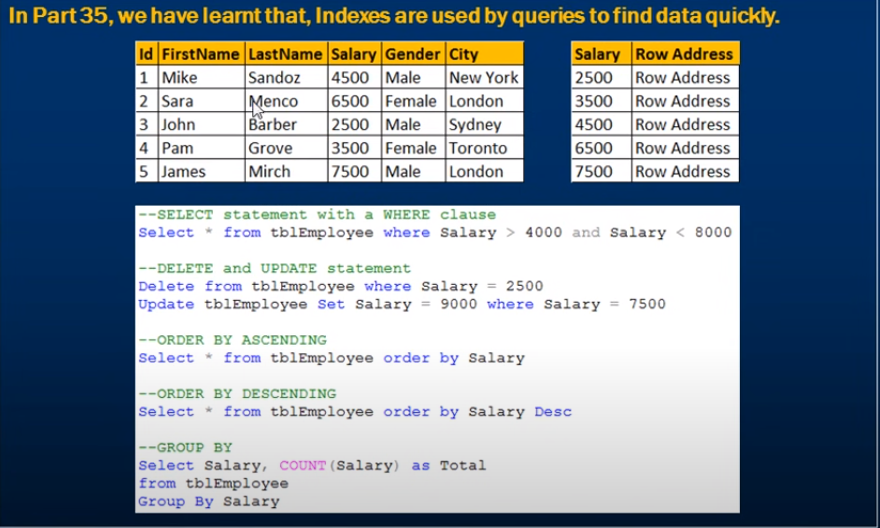

# Advantages and disadvantages of indexes

- Advantages and disadvantages of indexes 
- Type of queries that can benefit from indexes
- Covering Queries

#
- Performace improve coz salary sorted order 
- from seocnd table quick reference by row address 

   First Table Clustered    Second Table Non-clustered
    
- First querry go to second table and coz salary sorted order that's why it find it very quickly by row **address reference** 
- Group by of same salary count employee also benificaly coz salary already sorted

# 

### Disadvantages of Indexes 

**Additional Disk Space** 
- Clustered Index does not, required any additional storage.
- Every Non-Clustere index requires additional space as it is tored separately from the table.
- The amount of space required will depend on the size of the table and the number and types of columns used in the index

**Insert Update and Delete statements can become slow**
- When DML(Data Manipulation Langulage) statements (Insert, Update, Delete) modifies data into a table,
- The data in all the indexes also needs to be updated.
- Indexes can help to search and located the rows performance of the data modifications.

**What is a covering query**
- If all the columns that you have requested in the Select clause of query,
- are present in the index, then there is no need to lookup in the table again. 
- The requested columns data can simply be returned from the index

**A clustered index always covers a query**
- since it contains all of the data in a table.
- A composite index is an index on two or more columns
- Both clustered and non-clustered indexes can be composite indexes. To a certain extent, a composite index, can cover a query 