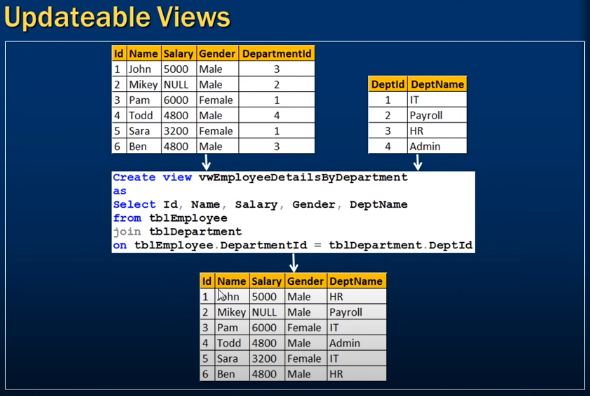
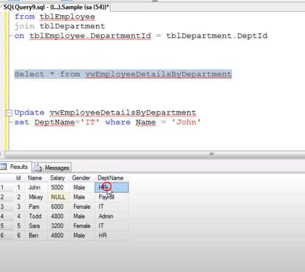
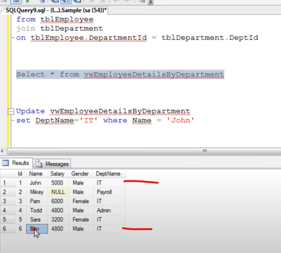
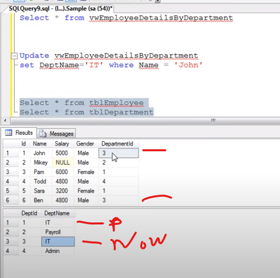

# Updatable views in sql server
--
### We see all the column except Salary 
- Create view for that
```sql
    Create view vwEmployeesDepartmentEceptSalary
    as 
        Select Id, Name, Gender, Department
        from tblEmployee;
```

- Run the view 

```sql
    Select * from vwEmployeesDepartmentEceptSalary;
```

- View is Virtual table NOT Store actual data Okay.
- View actual get data from actual tblEmployee 

### Update, Insert, Delete on veiw Effect on base table (tblEmployee)

- Update view 
- Using view Update data on Base table (tblEmployee)

```sql
    Update vwEmployeesDepartmentEceptSalary
    set Name = 'Mikey' where Id = 2
```

- Delete view records aslo effect on base table (tblEmployee)

```sql
    Delete from vwEmployeesDepartmentEceptSalary where Id = 2;
```

- Insert data into view which is also affected base table (tblEmployee)

```sql 
    Insert into vwEmployeesDataExceptSalary values (2, 'Mikey', 'Male', 2);
```

### Updateable Views
- If Multipule table create view then what happens (Update, Delete, Insert)



- We want to update jhon HR Department to IT department 


- But look Ben aslo change into IT



## Analysis
- Let's Analysis why Ben departments also update 

- No matter it single or multipule base table 

- when you (update, insert, delete) base table againset query Run coz view not store any data 

- view update, insert, delete query incorrectly issue query 
 
 - as a result both table issue update query and change department name



-- 
#
### Conclusion:
- If a veiw is based on multiple tables, and if you update the view, 
- It may not update the underlying base tables correctly.
- To correctly update a view that is based on multiple table.
- Instead of triggers are used.

