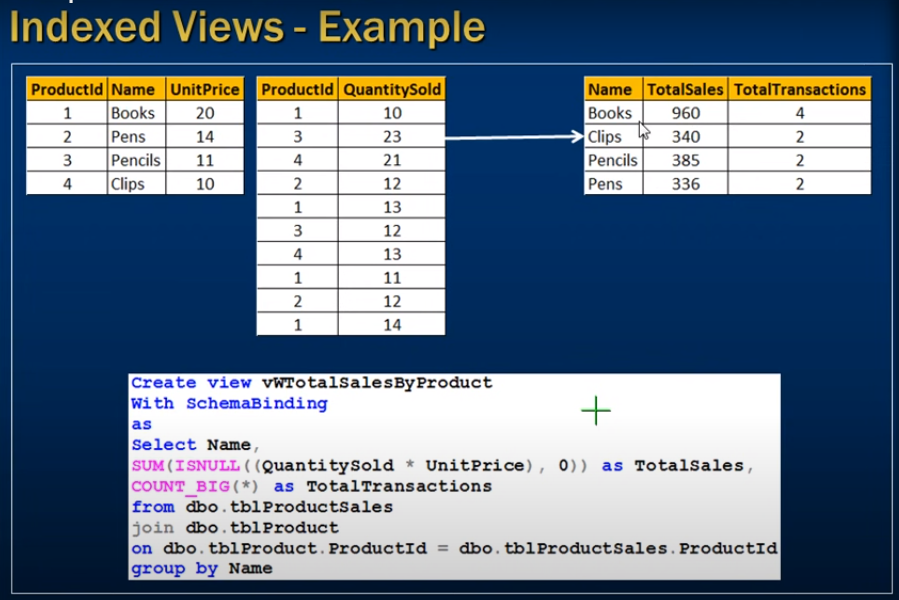
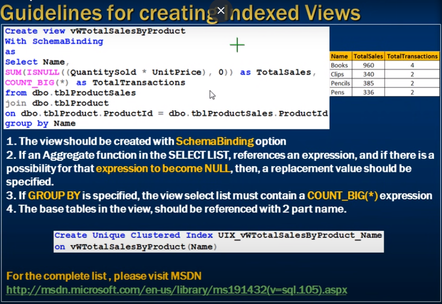

# *** Indexed views in sql server ***

- What is an Indexed view ? 
- OR
- What happens when you create an Index or a view?
___ 

- A standard or Non-indexed view is just a stored SQL query. 
- When, we try to retrieve data from the view,
- the data is actually retrieved from the underling base tables

- So a view is just virtual table it does not store any data, by default.

- However, when you create an index, on a view, the view gets materialized. 
- this means, the view is now, capable fo storing data.

- In Sql server, we call them Indexed views and in Oracle, Materialized views.

# 



# Creating indexes on view few rules are:

1) Thew view should be created with SchemaBinding option 
2) If an Aggregate function in the **SELECT LIST**, references an expressiong and if there is apossibility for that **expression to become NULL** then a replacement value should be specified.

3) If GROUP BY is specified, the view select list must contain a **Count_BIG(*)** expression 
4) The base tables in the view, should be referenced with 2 part name.



### Index creating on views

```sql
    Create Unique Clustered Index UIX_vwTotalScalesByProduct_Name
    on vwTotalSalesByProduct(Name)
```

- After creating index on view it significantly improves performance 
- Every time inser into transaction table that time 
- View index update accordingly 
- select run prity fast on view coz index 
