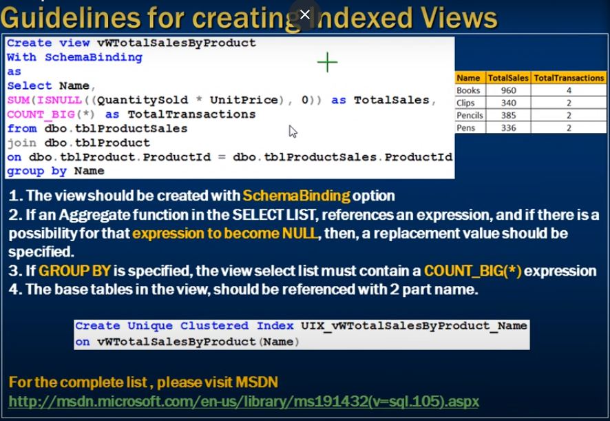

# *** View limitations in sql server ***

--- 

- View Limitations
f
--- 

1) You can not pass parameters to a view. Table valued functions are an excellent repalcement for parameterized views.

2) Rules and Defaults can not be associated with views.

3) The Order by caluse is invalied in views unless TOP or For XML is also specified.

4) **Views Or Function** can not be based on temporary tables.

