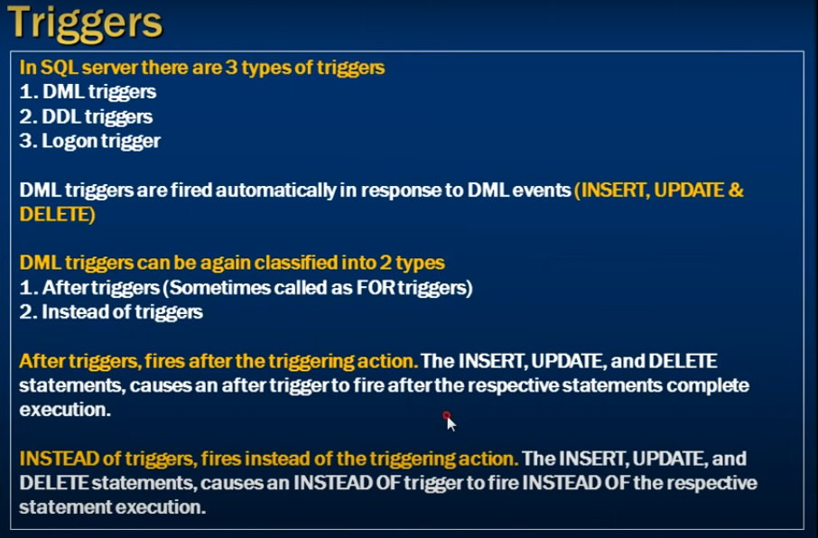
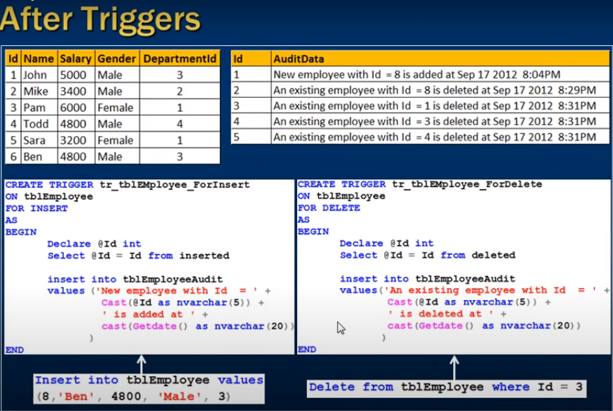

# *** DML triggers in sql server ***

--- 
- Different types of triggers 
    DML - Data Manipulation Language
    DDL - Data Definition Language
--- 



In SQL Server there are 3 types of triggers

1) DML triggers
2) DDL triggers
3) Logon triggers

--- 

DML triggers are fired autometically in response to DML events (Insert, Update, Delete)

DML triggers can be agin classified into 2 types

1) After triggers (Somethimes called as FOR triggers)
2) Instead of triggers

- After triggers, fires after the triggering action.
- The INSERT, Update and Delete statements, causes an after triggers to fire after the respective statemnts complete execution.

- INsted of triggers, fires instedad of the triggering action.
- The Insert, Update and Delete statemnts, causes an Inserad of trigger to fire Insetad of the respective statement execution.
---

## Example of After Trigger 

- If we inserted a record into tblEmployee table 
- automatically trigger to capture the id of new inserted record to tblEmployeeAudit



```sql
    Select * from tblEmployee;

    Select * from tblEmployeeAudit;

    Create Trigger tr_tblEmployee_ForInsert
    On tblEmployee 
    For Insert
    As
    Begin
        Declare @Id int
        Select @Id = Id from inserted

        insert into tblEmployeeAudit
        values ('New employee with Id = ' + Cast(@Id as nvarchar(5)) + 'Is added at ' + cast(Getdate() as nvarchar(20)) )
    End
```

### inserted table

- it is special table which is contain newly inserted records copy under inserted table 
- it is only avaliable the context into trigger 

- Example

```sql
    insert into tblEmployee values('Mehedi', 20202, 2);
    -- For Trigger is fire then we get this values inside the trigger (inserted) table
```


## For Delete Trigger

- For delete  or After delete the trigger  

```sql
    Create Trigger tr_tblEmployee_ForDelete
    on tblEmployee
    For Delete
    As 
    Begin
        Declare @Id int
        Select @Id = Id from deleted

        insert into tblEmpoyeeAudit
        values('An existing employee with Id =' + cast(@Id as nvarchar(5)) + 'is Deleted' + cast(Getdate() as nvarchar(20)));
    End
```

### Deleted table

- It is a speciall table utlize the deleted records hold 
- Deleted records are Identical to actual records which are deleted 

```sql
    Delete from tblEmployee where Id = 2;

    -- we get the deleted records user Deleted table inside trigger 
```


