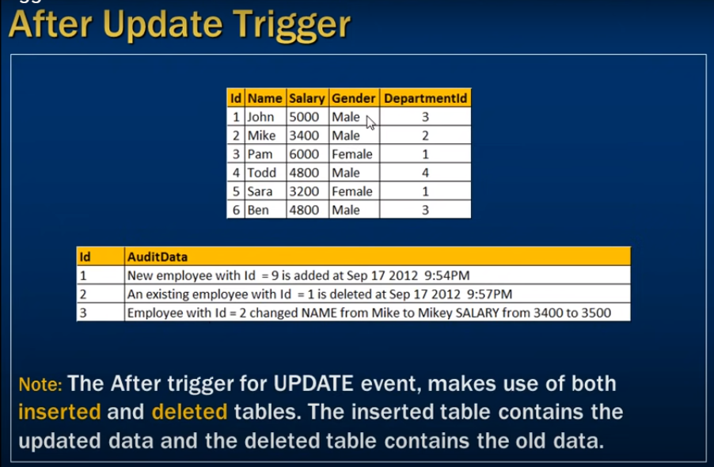

# *** After update trigger ***

- After Update trigger (In this session)



- What happens if update on tblEmployee table (inserted, deleted)

| Id | Name    | Salary | Gender |
|----|---------|--------|--------|
| 1  | Mehedi  | 3000   | Male   |
| 2  | Hasan   | 4000   | Male   |
| 3  | Suchana | 50000  | Female |


```sql
    Create trigger tr_tblEmployee_ForUpdate
    on tblEmployee
    For Update
    as
    Begin
        Select * from deleted;
        select * from inserted;
    End
```

```sql
    Update tblEmployee set Name = 'Nayema', Salary = 70000 where Id = 3;
```

- OUTPUT from  update Trigger 

- deleted  table 

    | Id | Name    | Salary | Gender |
    |----|---------|--------|--------|
    | 3  | Suchana | 50000  | Female |


- inserted  table

    | Id | Name    | Salary | Gender |
    |----|---------|--------|--------|
    | 3  | Nayema | 70000  | Female |

### We want to capture the changes when updating tblEmployee

```sql
    Create trigger tr-tblEmployee_ForUpdate
    on tblEmployee
    For Update
    as
    Begin
        Declare @Id int
        Declare @OldName nvarchar(20), @Name nvarchar(20)
        Declare @OldSalary nvarchar(20), @Salary nvarchar

        Declare @AuditString nvarchar(1000)

        Select * into #TempTable
        from inserted;

        while(Exists(Select Id from #TempTable))
        Begin
            Set @AuditString = ''

            -- we peek right ID
            Select Top 1 @Id = Id , @NewName = Name from #TempTable;

            Select @OldName = Name, @OldGender = Gender from deleted where Id = @Id;

            set @AuditString = 'Employee with Id = ' + Cast(@Id as nvarchar(4)) + 'changes' + 
            if(@OldName <> @NewName)
                Set @AuditString = @AuditString + 'Name from ' + @OldName + ' to ' + @NewName;
            if(@OldGender <> @NewGender)
                Set @AuditString = @AuditString + 'Gender from ' + @OldGender + ' to ' + @NewGender;

            insert into tblEmployeeAudit values(@AuditString)

            -- Delete the record from tempTable otherwise it will going to Infinity loop
            Delete from #TempTable where Id = @Id;

        End
    End    
```


- inserted table got updated data and deleted got old data 
