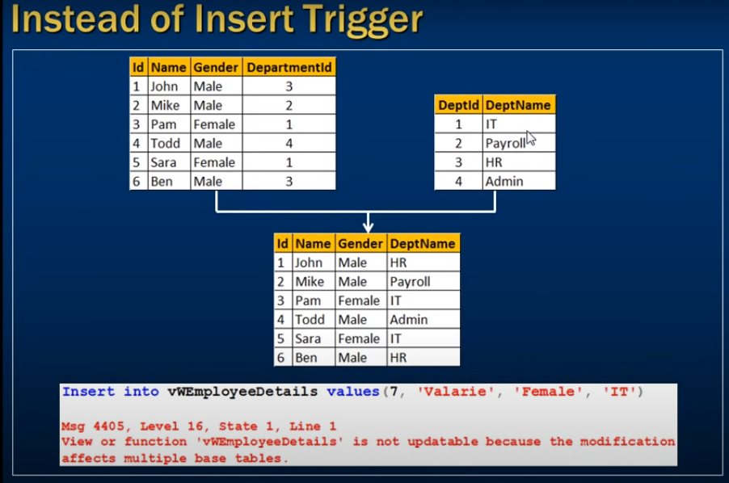

# *** Instead of insert trigger ***

- instead of trigger



this veiw as host multiple table

```sql
    Insert into vwEmployeeDetails values(7, 'Valarie', 'Female', 'IT');

```

- Instead of trigger useally use update view correctly 

- First create view

```sql
    Select * from tblEmployee;
    Select * from tblDepartment;

    Create veiw vwEmployeeDetails
    as
    Select Id, Name, Gender, DeptName
    from tblEmployee
    join tblDepartment
    on tblDepartment.DeptId = tblEmployee.DepartmentId


    Select * from vwEmployeeDetails;
```

- let's insert data into vwEmployeeDetails
- it will show error multiple base table affects 
```sql
    Insert into vwEmployeeDetails values(7, 'Valarie', 'Female', 'IT');

```

- Let's creating trigger to insert data into into view successfully

- Trigger created two speciall table (inserted, deleted)

```sql
    Create trigger tr_vwEmployeeDetails_insteadOfInsert
    on vwEmployeeDetails
    Instead of Insert
    as
    Begin
        Select * from inserted;
        Select * from deleted;
    End
```
- inserted table get value 
- but deleted table not get any value

### How we insert vwEmployeeDetails to multiple Base table data correctly ???

- using instead of trigger help you
- view only deptName we have to identify the Id of the dept
- the acording changes update

```sql

    Create Trigger tr_vwEmployeeDetails_InsteadOfInsert
    on vwEmployeeDetails
    Instead of Insert
    as
    Begin
        Declare @DeptId int

        -- Check if there is a valid DeprtMentId
        -- For the given DeptName

        Select @DeptId = DeptId
        from tblDepartment
        join inserted
        on inserted.DeptName = tblDepartment.DepatName

        -- If DepartmentId is null throw an error
        -- and stop processing
        if(@DeptId is null)
        Begin
            Raiserror('Invalid Department Name. Statement terminated', 16, 1)
            return
        End

        -- Finally insert into tblEmployee table
        Insert into tblEmployee(Id, Name, Gender, DepartmentId)
        Select Id, Name, Gender, @DeptId
        from inserted

    End

```

