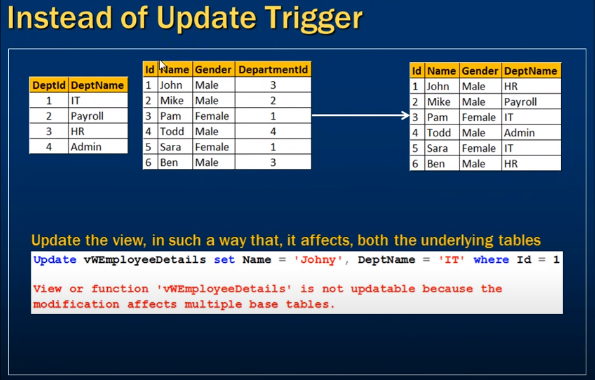
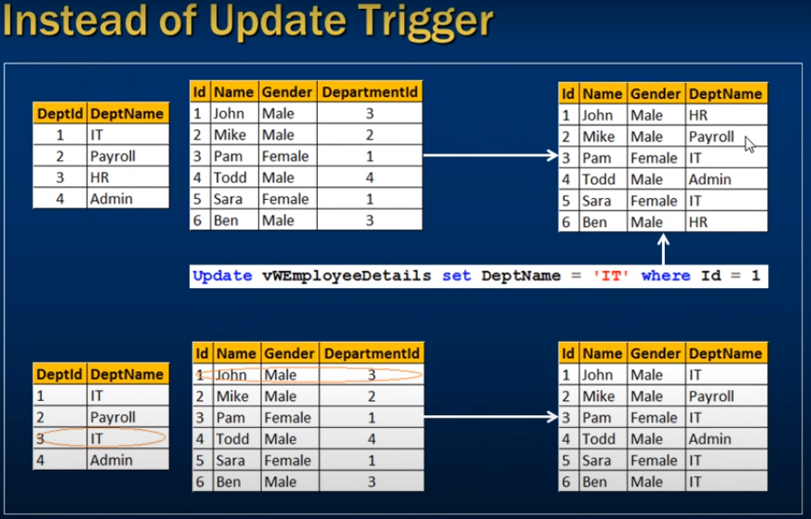

# *** Instead of update triggers in sql server ***

- Instead of Update trigger



- If a view is created from multiple tables
- when updating view which not happend coz modification multiple base table affected




- update only table on view work but it may effect wrong way

- multiple base table update coz error 

- To overcome this using instead of update trigger 


```sql
    Create Trigger tr_vwEmployeeDetails_InsteadOfUpdate
    on vwEmployeeDetails
    instead of Update
    as
    Begin
        -- If EmployeeId is updated
        if(Update(Id))
        Begin
            Raiserror('Id cannot be changed', 16, 1)
            Return
        End

        -- If DeptName is updated
        if(Update(DeptName))
        Begin
            Declare @DeptId int

            Select @DeptId = DeptId
            from tblDepartment
            join inserted
            on inserted.DeptName = tblDepartment.DeptName

            if(@DeptId is null)
            Begin
                Raiserror('Invalid Deprtment Name', 16, 1)
                Return
            End

            Update tblEmployee set DepartmentId = @DeprtId
            from inserted
            join tblEmployee
            on tblEmployeeId = inserted.Id
        End

        -- If Gender is Updated
        if(Update(Gender))
        Begin
            Update tblEmployee set Gender = inserted.Gender 
            from inserted
            join tblEmployee
            on tblEmployee.Id = inserted.Id
        End

        -- If Name is updated
        if(Update(Name))
        Begin
            Update tblEmployee set Name = inserted.Name
            from inserted
            join tblEmployee
            on tblEmployeeId = inserted.Id
        End

    End
```

- Update single table

```sql
    Update vwEmployeeDetails set DeptName = 'IT' where Id = 1;
```

- Update multiple tables from view update

```sql
    Update vWEmployeeDetails set Name = 'sony', Gender = 'Female', DeptName = 'Payrool' where Id = 1;
```


