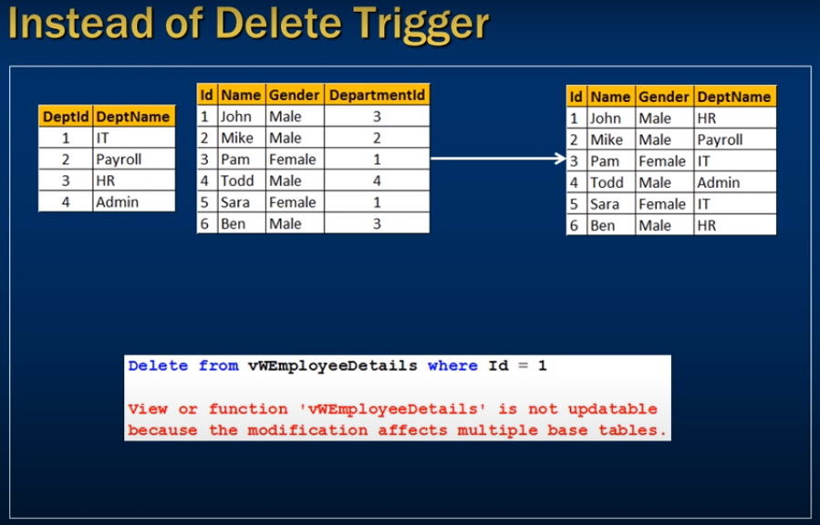
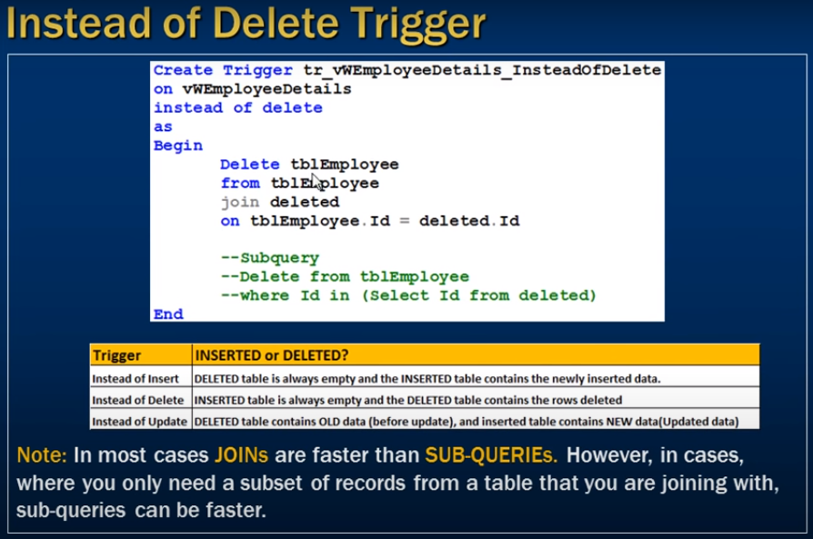

# *** Instead of delete triggers in sql server  ***

- multipule base tabse delete because of view 



```sql
    Select * from tblEmployee;
    Select * from tblDepartment;
```

```sql
    Create view vwEmployeeDetails
    as
    Select Id, Name, Gender, DeptName
    from tblEmployee
    join tblDepartment
    on tblEmployee.DepartmentId = tblDepartment.DeptId
```

```sql
    Select * from vwEmployeeDetails;
```

- Delete from view

```sql
    Delete from vwEmployeeDetails where Id = 1;
```

- Error occoured coz multiple base table affacted

--- 

- To overcome from this

```sql
    Create Trigger tr_vwEmployeeDetails_InsteadOfDelete
    on vwEmplyeeDetails
    instead of Delete
    as
    Begin
        Delete tblEmployee
        from tblEmployee
        join deleted
        on tblEmployee.Id = deleted.Id

        -- Subquery delete all records which are In(1, 2, 3, .....)
        /* Delete from tblEmployee
           Where Id in (Select Id from deleted)
        */
    End    
```


```sql
    -- Lets delete from the view now hot happend
    Delete from vwEmployeeDetails where Id IN(1,2)
```
