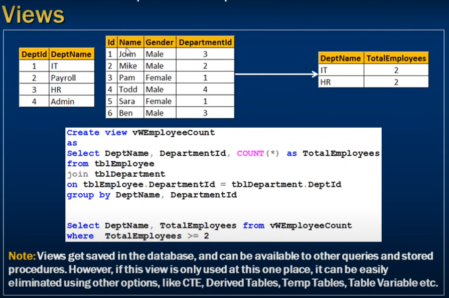
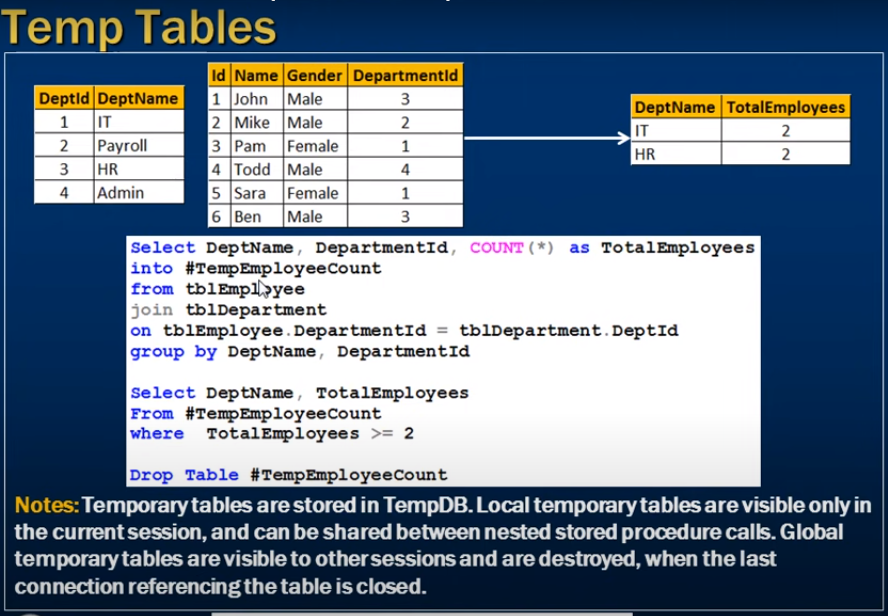
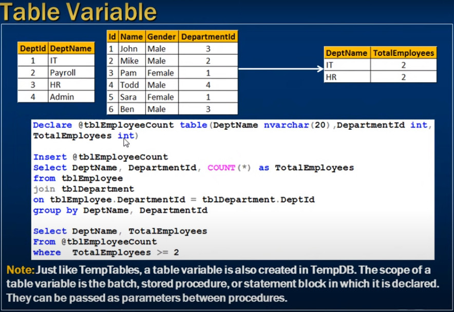
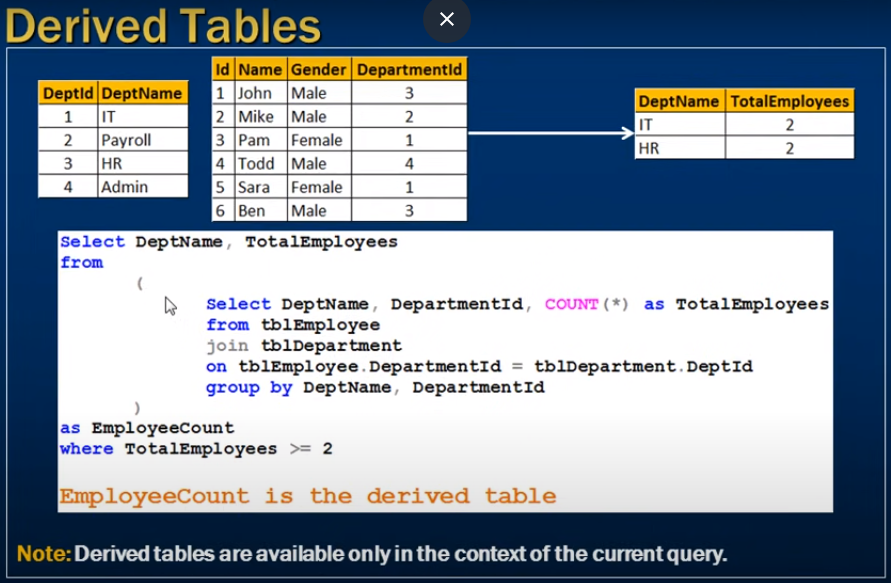

# *** Derived tables and common table expressions in sql server ***

---

- Derived tables and common table expressions
- Compare with - Views, Table Variable, Local and Global Temp Tables

--- 



- we want to see the how many employee work each department and count > 2

- we can create view for that

```sql
    
    Create View vwEmployeeCount
    as
        Select DeptName, DepartmentId, count(*) as TotalEmployees
        from tblEmployee
        join tblEmployee.DepartmentId = tblDepartment.DeptId
        Group By DeptName, DepartmentId;


        Select DeptName, TotalEmployees from vwEmployeeCount where TotalEmployees >= 2

```

- only for one select statement use this view not make any sences for creating a view for that

---

- Other solution we have to think 



- Using temp table concept

```sql
    Select DeptName, DepartmentId, Count(*) as TotalEmployees
    into #TempEmployeeCount
    from tblEmployee
    join tblDepartment
    on tblEmployee.DepartmentId = tblDepartment.DeptId
    Group by DeptName, DepartmentId


    Select deptName, TotalEmployees
    from #TempEmployeeCount
    where TotalEmployees >= 2


    Drop Table #TempEmployeeCount;

```

---


- Same thing using Table Variable 




- If we decleare a varaible of table it has column and datatype

```sql
    Declare @tblEmployeeCount table(DeptName nvarchar(200), DepartmentId int, TotalEmployees int)

    Insert @tblEmployeeCount
    Select DeptName, DepartmentId, Count(*) as TotalEmployees
    from tblEmployee
    join tblDepartment
    on tblEmployee.DepartmentId = tblDepartment.DeptId
    group by DeptName, DepartmentId;


    Select DeptName, TotalEmployees 
    From @tblEmployeeCount
    Where TotalEmployees >= 2;

```

--- 

- We can achieved same things using Derived Tables





```sql
    Select DeptName, TotalEmployees
    from (
        -- this like a table
        Select DeptName, DepartmentId, Count(*) as TotalEmployees
        from tblEmployee
        join tblDepartment
        on tblEmployee.DepartmentId = tblDepartment.DeptId
        Group by DeptName, DepartmentId
    ) as EmployeeCount
    where TotalEmployees >= 2;f

```


---

- We can achieve same things by CTE


```sql

    -- EmployeeCount is common table expression (parameter are optional if select statement return unique columns)
    With EmployeeCount(DeptName, DepartmentId, TotalEmployees)
    as
    (
        -- this is like a table
        Select DeptName, DepartmentId, Count(*) as TotalEmployees
        from tblEmployee
        join tblDepartment
        on tblEmployee.DepartmentId = tblDepartment.DeptId
        group by DeptName, DepartmentId
    )

    Select DeptName, TotalEmployees
    from EmployeeCount
    where TotalEmployees >= 2

```

- A CTE can be thought of as temporary result set that is defined within the execution
-  scope of a single Select, Insert, UPdate, Delete or Create View statement.

- A CTE is similare to a derived table in that it is not stored as an object and lasts 
- only fo rhte duration of the querry 
