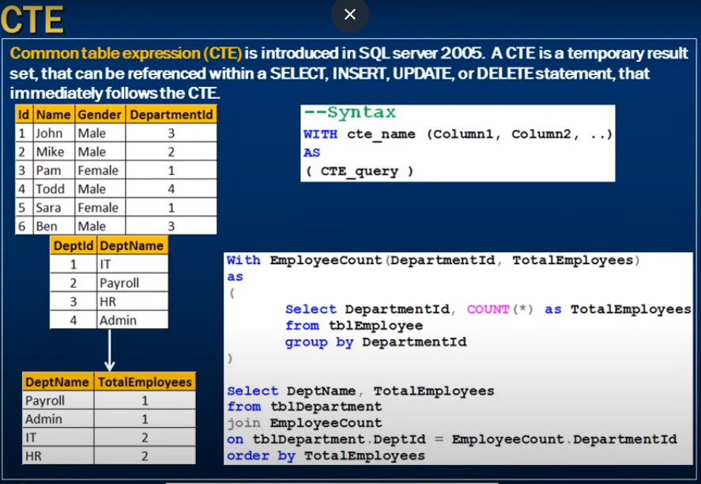

# *** CTE in sql server ***

- Common table expressions

--- 



- Common table expression (CTE) is introduced in SQL server 2005. 
- A CTE is a temporary result set
- That can be referenced whithin a 
- Select, Insert, Update, or Delete statement - that immediately follows the CTE


```sql
    WITH cte_name (column1, column2, ....)
    As
    (CTE_Querry)
```


```sql
    With EmployeeCount(DepartmentId, TotalEmployees)
    as
    (
        Select DepartmentId, Count(*) as TotalEmployees
        from tblEmployee
        group by DepartmentId
    )

    Select DeptName, TotalEmployees
    from tblDepartment
    join EmployeeCount
    on tblDepartment.DeptId = EmployeeCount.DepartmentId
    order by TotalEmployees;

```

- NOTE: nothing in between CTE and Select staatement 
- Imidiately after CTE we have use it


```sql
    With EmployeeCount(DepartmentId, TotalEmployees)
    as
    (
        Select DepartmentId, Count(*) as TotalEmployees
        from tblEmployee
        group by DepartmentId
    )

    Select 'Hello' -- it will show error

    Select DeptName, TotalEmployees
    from tblDepartment
    join EmployeeCount
    on tblDepartment.DeptId = EmployeeCount.DepartmentId
    order by TotalEmployees;

```

- It is possiable that multiple CTE at a time

```sql
    With EmployeesCountBy_HR_Admin_Dept(DepartmentId, TotalEmployees)
    as
    (
        Select DepartmentId, Count(*) as TotalEmployees
        from tblEmployee
        group by DepartmentId
    )

EmployeesCountBy_Payroll_IT_Dept(DepartmentId, TotalEmployees)
    as
    (
        Select DepartmentId, Count(*) as TotalEmployees
        from tblEmployee
        group by DepartmentId
    )


Select * form EmployeesCountBy_HR_Admin_Dept
UNION  -- for this union keyworkd both trieted as single select statement
Select * from EmployeesCountBy_Payroll_IT_Dept

```
