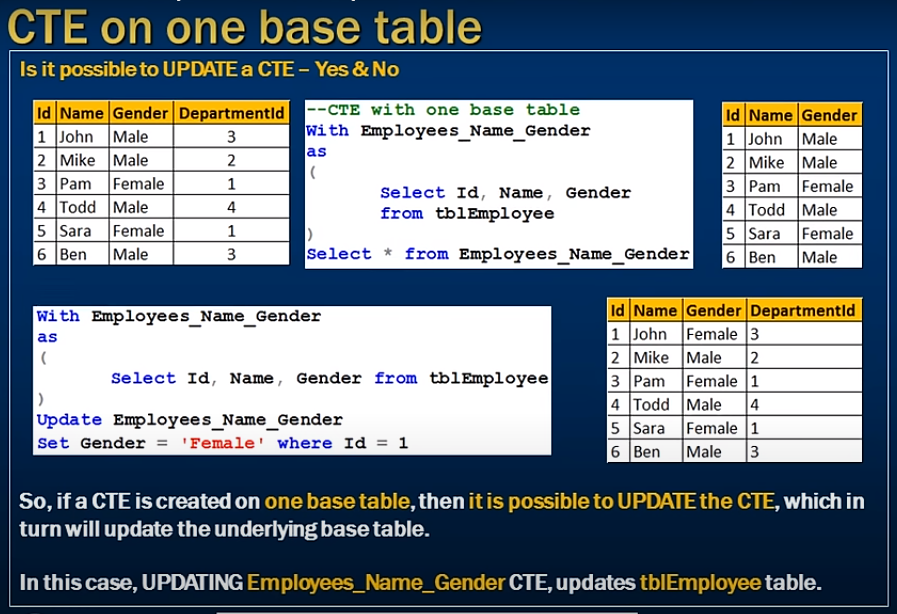
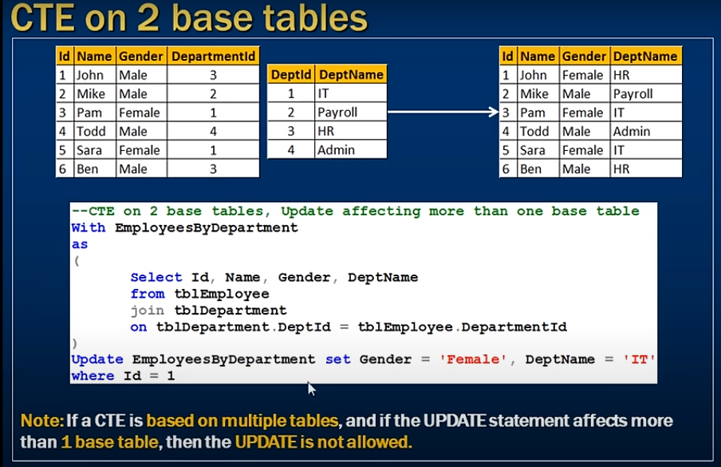
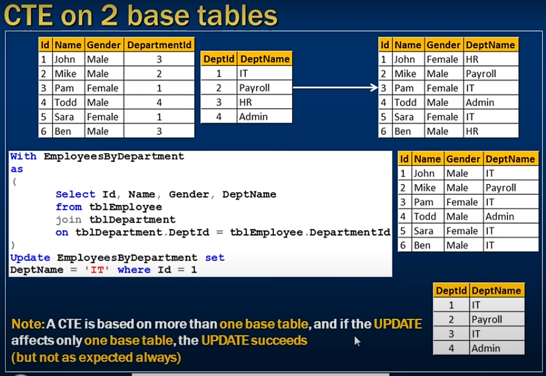

# *** Updatable common table expressions in sql server ***

- Updatable common table expressions (CTE)



- sometimes we can update CTE
- sometimes we can not update CTE

- We will discuss that both case:


- If CTE create for 1 base table 
- then it update on CTE can update the base table

- If multiple tables create CTE then it is not update from CTE here is issue

```sql
    Select * from tblEmployee;
    Select * from tblDepartment;

    -- CTE with one base table
    With Employees_Name_Gender
    as
    {
        Select Id, Name, Gender
        from tblEmployee;
    }
    Select * from Employees_Name_Gender


    -- CTE with one base table and Update querry
    With Employees_Name_Gender
    as
    {
        Select Id, Name, Gender from tblEmployee
    }
    Update Employees_Name_Gender Set Gender = 'Female' where Id = 1

    -- CTE update actual employee table
    Select * from tblEmployee;
```

- CTE with 2 base tables

```sql
    With EmployeesByDepartment
    as
    {
        Select Id, Name, Gender, DeptName
        from tblEmployee
        join tblDepartment
        on tblDepartment.DeptId = tblEmployee.DepartmentId
    }
    Update EmployeesByDepartment set Gender = 'Male' werhe Id = 1;
    -- Note: If a CTE is based on more than one table and if the Update affects only one base table then Update is Allowed
```



- Update not allowed 

```sql
    With EmployeesByDepartment
    as
    {
        Select Id, Name, Gender, DeptName
        from tblEmployee
        join tblDepartment
        on tblDepartment.DeptId = tblEmployee.DepartmentId
    }
    Update EmployeesByDepartment set Gender = 'Male', DeptName = 'IT' werhe Id = 1;
    -- Note: If a CTE is based on more than one table and if the Update affects only one base table then Update is NOT Allowed
```

- One more sennario 



### When you update CTE their are some senario 

1) If a CTE is based on a single base table, then the UPDATE succeeds and works as expected.

2) If a CTE is based on more than one base table and If the UPDATE affects multiple base tables, the update is not allowed and the statement terminates with an error.

3) If a CTE is base on more than one base table and If the Update affects only one base table the Update succeeds (but not as expected always)

