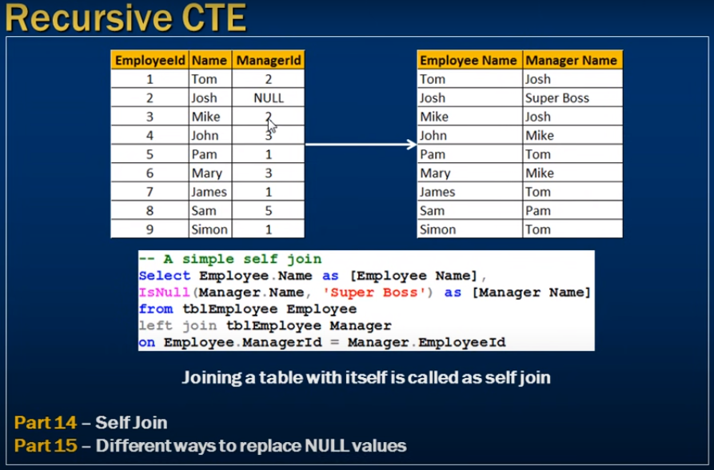
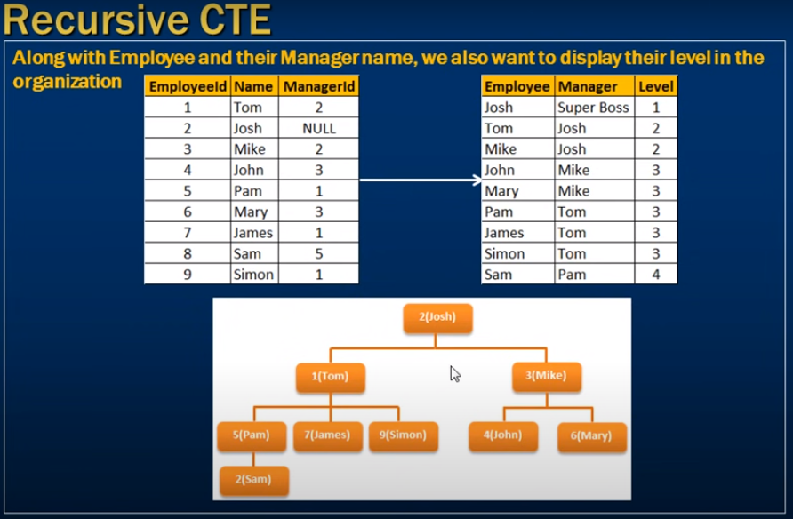
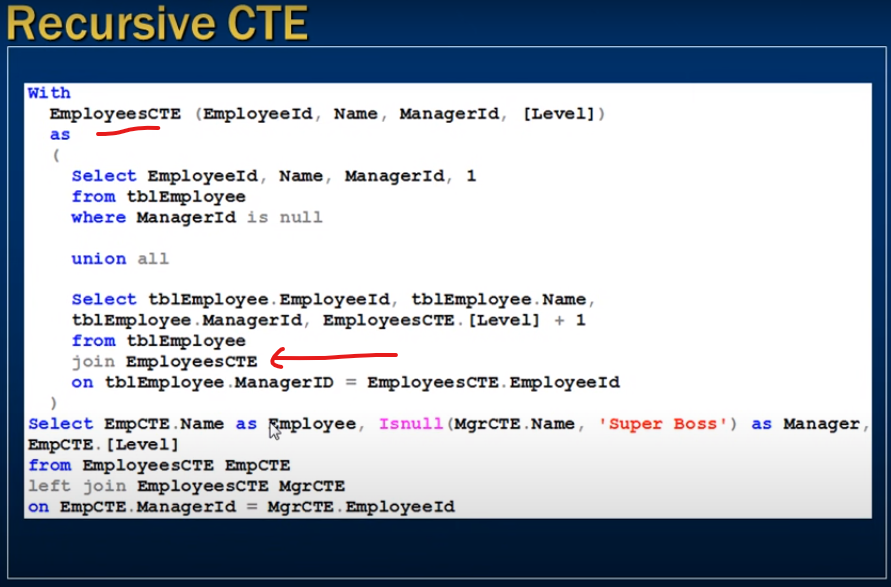

# *** Recursive CTE in sql server ***

- Recursive CTE & the problems they solve



- Self-Join Who is manager for whom 
- we can identify using self-join in same table


 

 

```sql

    With 
    EmployeesCTE(EmployeeId, Name, ManagerId, [Level])
    as
    {
        Select EmployeeId, Name, ManagerId, 1
        from tblEmployee
        where ManagerId is null -- here the manager info

        union all

        Select tblEmployee.EmployeeId, tblEmployee.Name, tblEmployee.ManagerId, EmployeeCTE.[Level] + 1
        from tblEmployee
        join EmployeeCTE --  CTE call here (Recursive) 
        on tblEmployee.ManagerID = EmployeeId
    }
    Select EmpCTE.Name as Employee, Isnull(MgrCTE.Name, 'Super Boss') as Manager, EmpCTE.[Level]
    from EmployeesCTE EmpCTE
    left join EmployeeCTE MgrCTE 
    on EmpCTE.ManagerId = MgrCTE.EmployeeId;

```