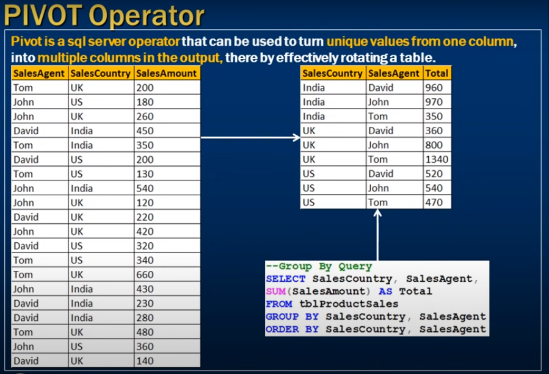
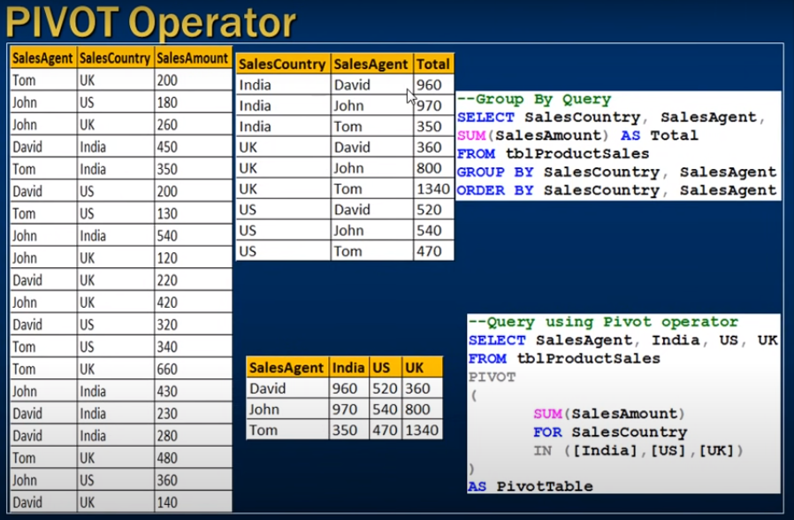
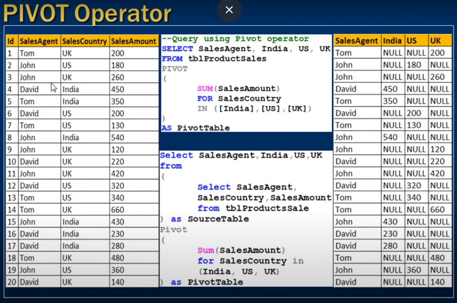

# *** Pivot in sql server ***

- Pivot operator 

--- 

- Pivot is sql server operator that can be used to turn unique values from one column 
- into multiple columns in the output, there by effectively rotating a table

- Group by example 


- Pivot example 



```sql
    Select salesAgent, India, US, UK
    From tblProductSales
    Pivot 
   (
     SUM(SalesAmount)
     For SalesCountry
     In ([India], [US], [UK])
   )
   as PivotTable; 

```

- Id column remove by formating 

