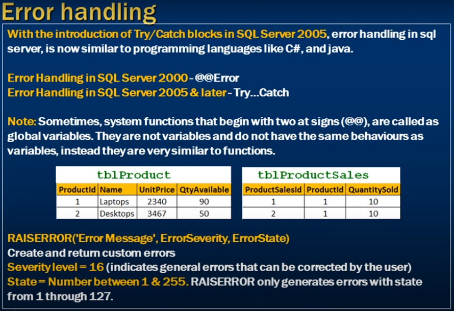
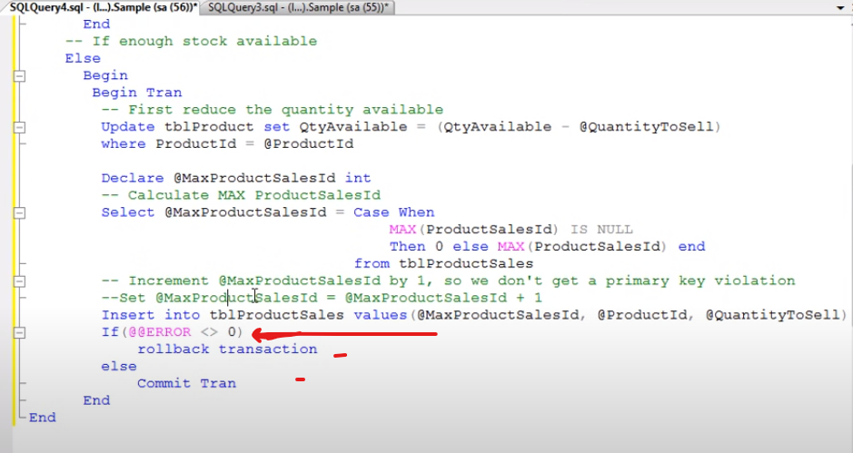
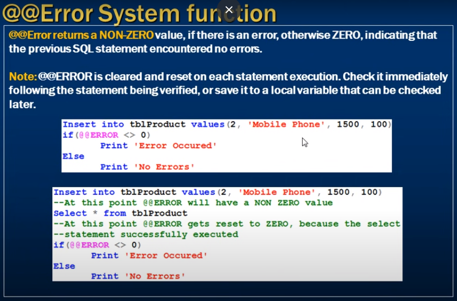
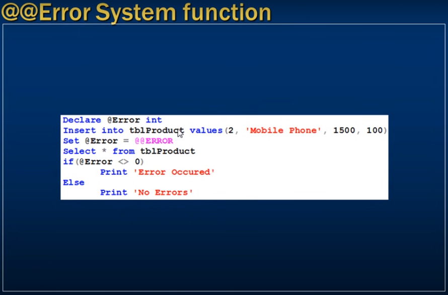

# *** Error handling in sql server ***

- Global Error variable  @@ERROr

- Some key point have to remember
- @@ERROR check each statement 
- Coz each statement reset the @@ERROR values
- to get excext output we get it by this way

- Create local variable with store default value 

