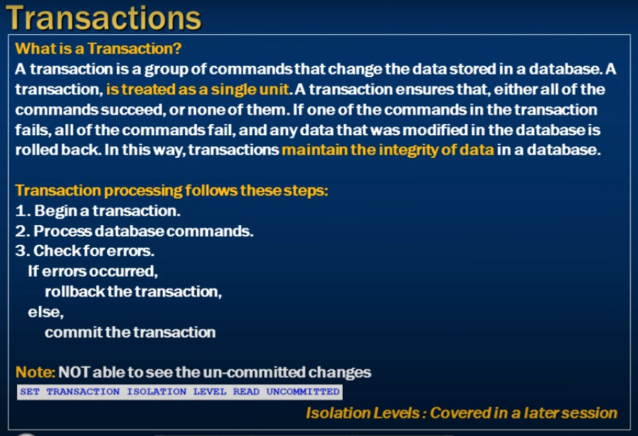
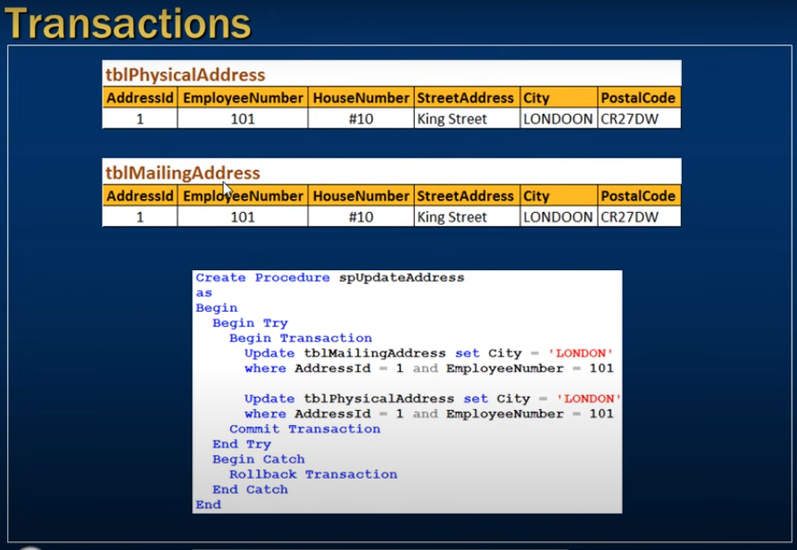

# *** Transactions in sql server ***

- Transactions in SQL Server 

--- 



- In case transaction if all data succefful the save 
- If any data fail then hole serise of command roleback 
- Transactions maintain the integrity of data


--- 

let's say we want to update data 

```sql
    update tblProduct set QtyAvailable = 200 where ProductId = 1;
``` 
- the change effact permanently imediately 
- If it is use in any transaction then data not imediately save

### Transection example 

QtyAvailable = 300;

- run querry

```sql
    Begin Transaction
            update tblProduct set QtyAvailable = 200 where ProductId = 1;

```
- when we exe upper query 
- withnin same session window => querry 
- run tblProduct 

```sql
    Select * from tblProduct;
```

- then we see 300 coz imideately date not save

---

- open new window 
- then run 

```sql
    Select * from tblProduct;
```

- the date take long time 
- coz we begin transcation 
- not close
- ACID isolate the data for not bing open to when trancation 
- other user not see the uncommited data by Default 

- to see uncomited data 

```sql
    Set Transaction Isolation level Read uncommited;
```

```sql
    Rollback Transaction;
```
- see the original previous data 

```sql
    -- If we want to change data permanently save then
    -- After Tran
    Commit Transaction; 
```


---


### Update City  SP

```sql
    Create Procdure spUpdateAddress
    as
    Begin
        Begin Try
            Begin Transaction
                update tblMailingAddress set City = 'LONDON' where AddressId = 1 and EmployeeNumber = 101

                Update tblPhysicalAddress set City = 'LONDON' where AddressId = 1 and EmployeeNumber = 101
            Commit Transaction
        End Try
        Begin Catch
            Rollback Transaction
        End Catch
    End
```

- The upper querry is commited cussfully coz it has no error 

### Now intentionally create error 

- be coz of collumn length 15 less from insert city length Gretter 20 character 


```sql
    Create Procdure spUpdateAddress
    as
    Begin
        Begin Try
            Begin Transaction
                update tblMailingAddress set City = 'LONDON' where AddressId = 1 and EmployeeNumber = 101

                Update tblPhysicalAddress set City = 'LONDON London' where AddressId = 1 and EmployeeNumber = 101
            Commit Transaction
        End Try
        Begin Catch
            Rollback Transaction
        End Catch
    End
```

- This querry rollback 
- both of the serise of update querry successed or Non-Of them