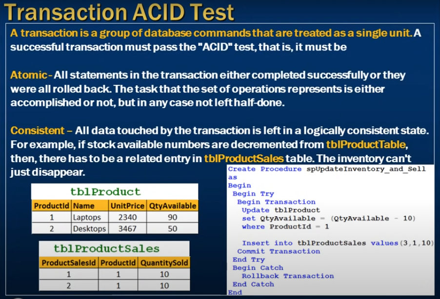
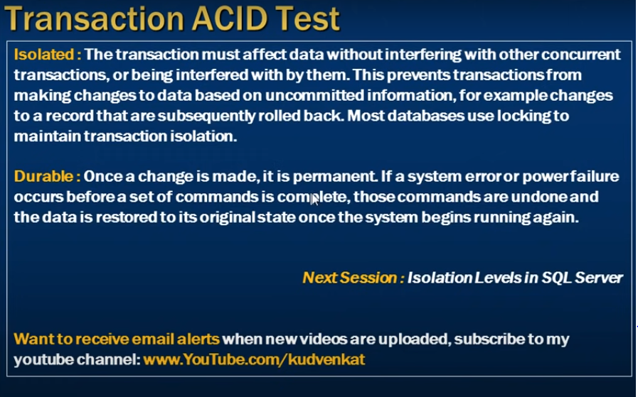
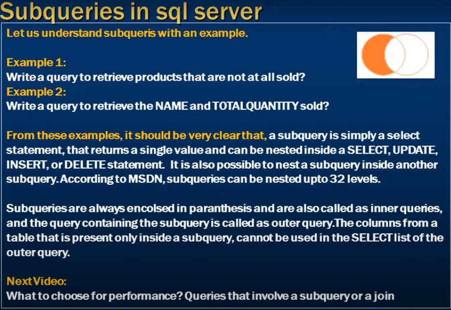

# Transactions in sql server and ACID Tests

- Transaction ACID Test 

---

- A transaction is a group of database commands that are treated as a single unit.
- A successfull transaction must pass the ACID that is it must be.
- Atomic : All statements in the transaction either completed successully or 
- they were all rolled back.
- the task that the set of operations represents is either accomplished or not. but in any case not left half done

- Consistent: All data touched by the transaction is left in a logically consistent state.
- For example If stock available numbers are decremented from tblProductTable
- then there has to be related entry in tblProductsSales table. Te inventory cant't just disappear

```sql
    Create procedure spUpdateInventory_and_sell
    as 
    Begin
        Begin Try
            Begin Transaction
                Update tblProduct
                set QtyAvailabe = (QtyAvailable - 10)
                where ProductId = 1

                Insert into tblProductSales values(3, 1, 10)
            Commit Transaction
        End Try
        Begin Catch
            Rollback Transaction
        End Catch
    End
```




- Isolation means Tran A not intearfair with Tran B and VS
- single unit of work 
- Isolated: The transaction must affect data without interfering which other concerrent transactions,
- or begin interfered with by them.
- this prevents transactions from making changes to data based on uncommited information
- for example changes to a record that are subsequently rolled back
- most databases use locking to maintain transaction isolation
- Durable: Once a change is made it is permanent 
- If a system error or power failure occurs before 
- a set of commands is complete, those commands are undone and
- the data is restored to its orginal state 
- once the system begins running again



- we want to retrive product which is not sell at least one using subquerry?

```sql
    Select * from tblProducts;
    Select * from tblProductSales;

    -- Not sell at lest one

    Select Id, Name, [Description]
    from tblProducts 
    where Id Not In (Select distinct ProductId from tblProductSales)


```
- write querry using join to get same output 

```sql
     Select tblProducts.Id, Name, [Description]
    from tblProducts 
    left join tblProductSales
    on  tblProducts.Id = tblProductSales.ProductId
    where tblProductSales.ProductsId is null;

    -- left join gives matching and non matching rows
    -- we need only the left which are non-matching 
```

- we want to know which products we need to sell how much write a subquerry

```sql
    Select Name, 
    (Select Sum(QuantitySold) from tblProductSales where ProductId = 2tblProducts.Id) as QtySold
    from tblProducts
    order by Name;
```

- Same using Join 

```sql
    Select Name, Sum(QuantitySold) as QtySold
    from tblProducts
    left join tblProductSales
    on tblProducts.Id = tblProductSales.ProductId
    Group by Name;
```

