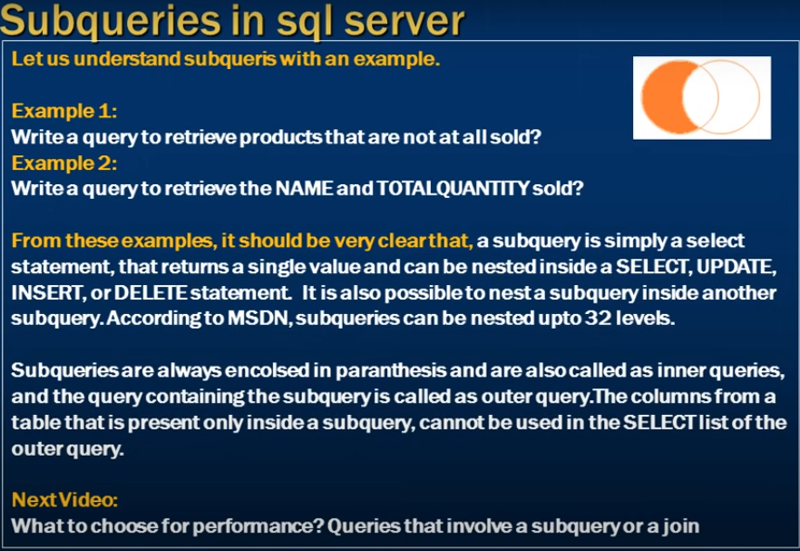

# Subqueries in sql

- Subqueries in sql server 



--- 

- Example 1
    - Write a query to retrieve products that are not at all sold?

- Example 2
    - write a query to retrieve the Name and TotalQuantity sold?

### From these examples it should be very clear that 
- a subquery is simply a select statement, that returns a single value and 
- can be nested inside a Select, Update, Insert, Delete statement.
- It is also possible to nest a subquery inside another subquery.
- According to MSDN, subqueries can be nested upto 32 level

- Subqueries are always enclosed in paranthesis and are aslo called as inner queries and the query containing the subquery is called as outer query.
- the columns from a table that is present only inside a subquery, cannot be used in the 
- Select list of the outer query


- we want to retrive product which is not sell at least one using subquerry?

```sql
    Select * from tblProducts;
    Select * from tblProductSales;

    -- Not sell at lest one

    Select Id, Name, [Description]
    from tblProducts 
    where Id Not In (Select distinct ProductId from tblProductSales)


```
- write querry using join to get same output 

```sql
     Select tblProducts.Id, Name, [Description]
    from tblProducts 
    left join tblProductSales
    on  tblProducts.Id = tblProductSales.ProductId
    where tblProductSales.ProductsId is null;

    -- left join gives matching and non matching rows
    -- we need only the left which are non-matching 
```

- we want to know which products we need to sell how much write a subquerry

```sql
    Select Name, 
    (Select Sum(QuantitySold) from tblProductSales where ProductId = 2tblProducts.Id) as QtySold
    from tblProducts
    order by Name;
```

- Same using Join 

```sql
    Select Name, Sum(QuantitySold) as QtySold
    from tblProducts
    left join tblProductSales
    on tblProducts.Id = tblProductSales.ProductId
    Group by Name;
```


