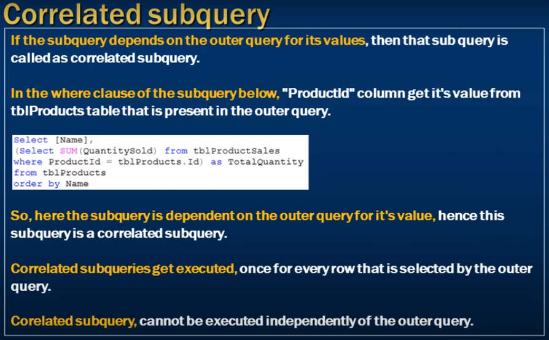

# Correlated subquery in sql

- **If the subquery depends on the outer query for its values.**
- then that sub query is called as correlated subquery

- **In the where clause of the subquery below** "ProductId" column get it's value from tblProducts table that is present in the outer query.

- **So, here the subquery is dependent on the outer query for it's value**
- hence this subquery is a correlated subquery.

- **Correlated subqueries get executed,** once for every row that is selected by the outer query

- **Corelated subquery,** cannot be executed independently of the outer query.



- this subquerry work independently 
    - Non-Corelated SubQuerry
```sql
    Select Id, Name, Description
    from tblProducts where Id Not IN (
        Select distinct ProductId from tblProductSales
    )
```

- Corelated SubQuerry 
- when inner querry depend on outer querry
- inner querry we can not run independently 
- Number of products sales of each items 

```sql 
    Select Name, 
     (Select Sum(QuntitySold from tblProductSales where ProductId = tblProducts.ProductId))
    from tblProducts;
```