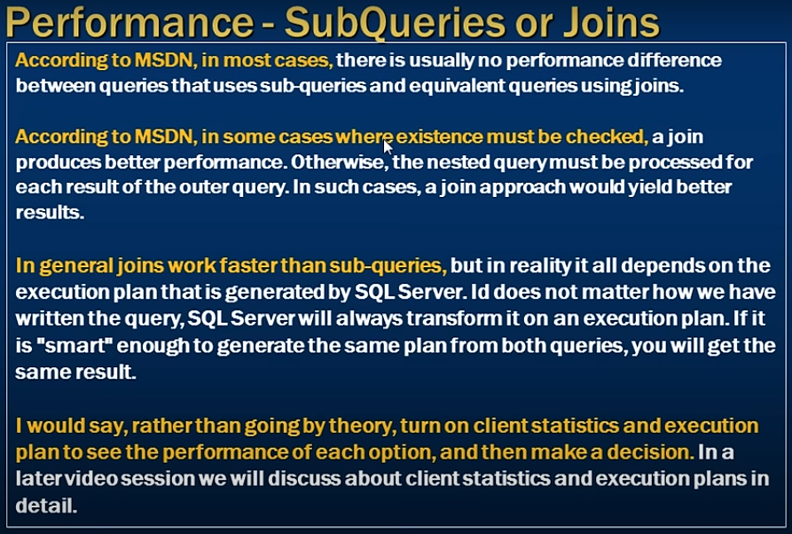

# What to choose for performance SubQuery or Joins

- According to MSDN in most cases: there is usually no performance difference between queries that uses sub-querries and equivalent queries using joins.


- A join producess better performance if the nested query must be processed for each result of the outer querry.  `(Join approach is better)`

- In general joins work faster than subqueries but all depends on the execution plan is generated by SQL Server. 

- `All the time SQL server Generate exectuion plan`

- To See ExePlan `Turn on client statistics and execution plan to see the performance of each option and then make a decision`



- Which product we are Sells

```sql
    Select Id, Name, Description
    from tblProducts
    where Id In (
        Select distinct ProductId from tblProductSales
    )
```

- Execution plan enable from top
- After run query we see the Execution plan 


```sql
    Select distinct tblProducts.Id, Name, Description
    from tblProducts
    inner join tblProductSales
    on tblProducts.Id = tblProductSales.ProductId
```

- How to drop the querry cache

```sql
    Checkpoint
    Go
    DBCC DropCleanBuffers; -- Clears query cache
    GO
    DBCC FreeDroccache; -- clears execution plan cache
```

- Get all the products which is not sold 
- It takes `4 s 93801 records to retrive`

```sql
    Select Id, Name, [Description]
    from tblProducts
    where Not Exists (Select * from tblProductSales where ProductId = tblProducts.Id);
```

- Same querry using join 

```sql
    Select tblProducts.Id, Name, [Description]
    from tblProducts
    left join tblProductSales
    on tblProducts.Id = tblProductSales.ProductId
    where tblProductSales.ProductId IS NULL
```

