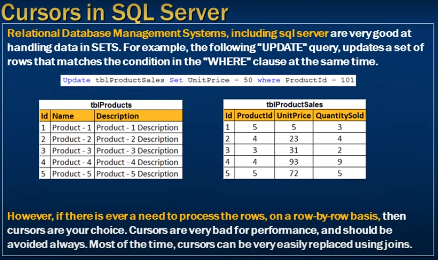
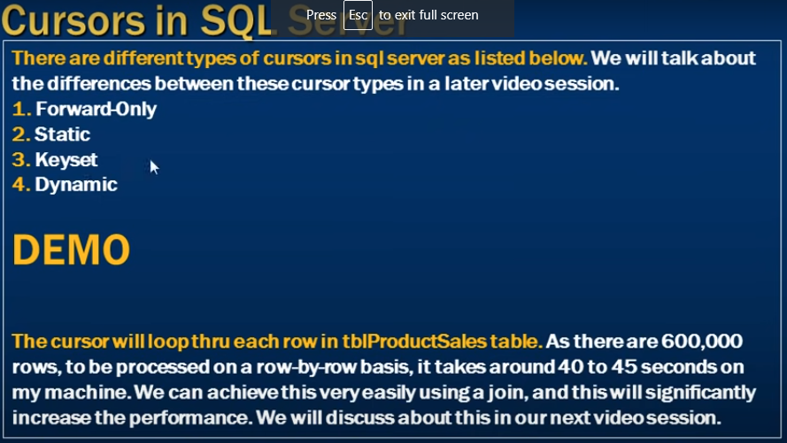

# Cursors in sql server

- Cursors in sql server 



```sql
    Update tblProductSales Set UnitPrice = 50 where ProductId = 101;
```

- In sql server different type of Cursors has



- Cursor is nothing but a pointer into a row 

- Declare a cursor 

```sql

    Declare @ProductId int
    Declare @Name nvarchar(30)

    Declare ProductCursor Cursor For
    Select Id, Name from tblProducts where Id <= 1000

    Open ProductCursor

    Fetch Next from ProductCursor into @ProductId, @Name

    While(@@Fetch_Status = 0)
    Begin

        print 'Id = ' + cast(@ProductId as Nvarchar(10)) + ' Name = ' + @Name
        Fetch Next from ProductCursor into @ProductId, @Name

    End

    Close ProductCursor
    DeAllocate ProductCursor;
```