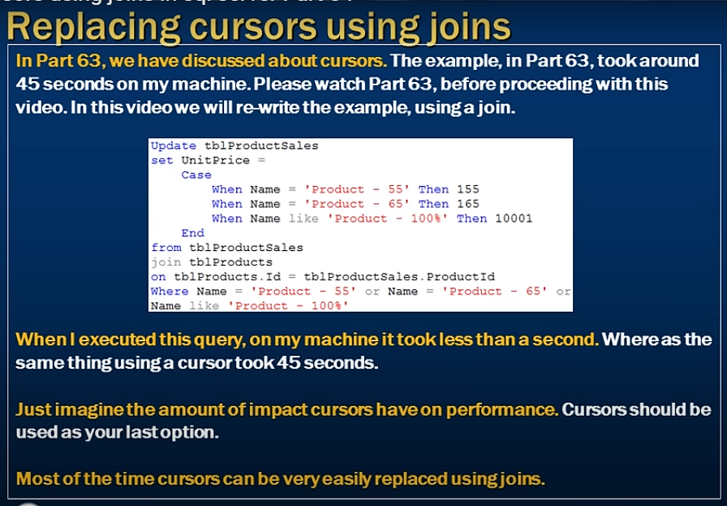

# Replacing cursors using joins in sql 

- Replacing cursors using joins 



```sql
    Update tblProductSales
    set UnitPrice = 
      case 
            when Name = 'Product - 55' Then 55
            when Name = 'Product - 65' Then 65
        End
    from tblProductSales
    join tblProducts 
    on tblProductsId = tblProductSales.ProductId
    where Name = 'Product - 55'  Or Name = 'Product - 65' 
```

- join is better then cursor 