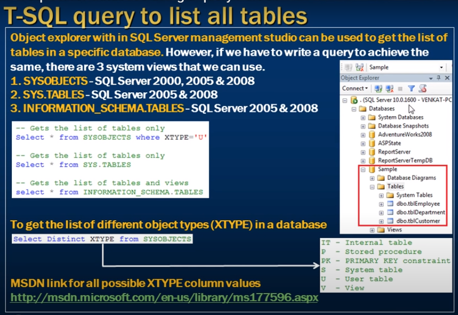
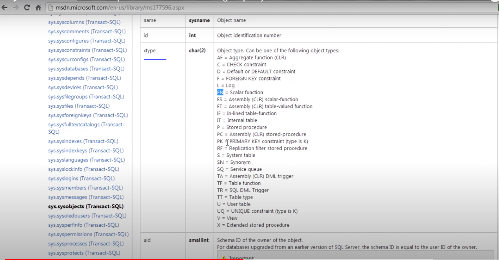

# List all tables in a sql server database using a query

- writing a Transact SQL query to list all the tables in a SQL Server database



- There are 3 system views that we can use.
1. Sysobjects - SQL server 2000, 2005 && 2008
2. Sys.Tables - SQL server 2005 & 2008
3. Information_Schema.Tables - SQL server 2005 & 2008

```sql
    Select * from sysobjects where xtype = 'FN';

    -- Depend on xtype we ge values 

```



- What are different type of distrinct xtype 

```sql
    Select distinct xtype from sysobjects;
```

- Return all the tables

```sql
    Select * from sys.Tables;

    Select * from sys.views;

    Select * from sys.procedures;
```

- Get table view by information_schema

```sql
    Select * from Information_Schema.Tables;

    Select * from INformation_Schema.views;

    Select * from Information_Schema.Routines;
```