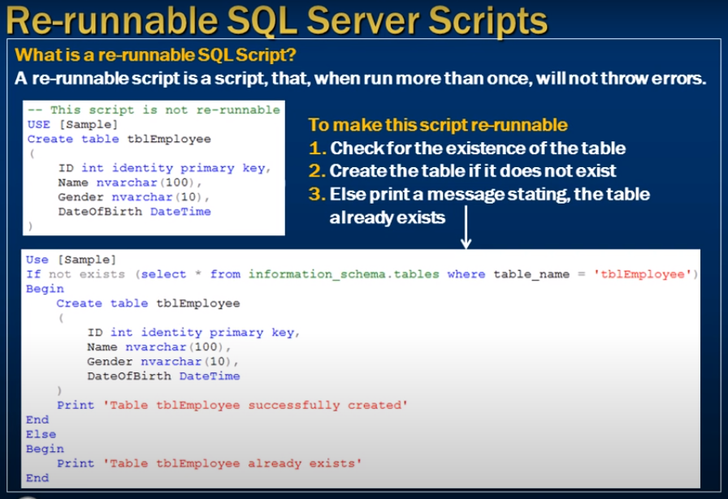
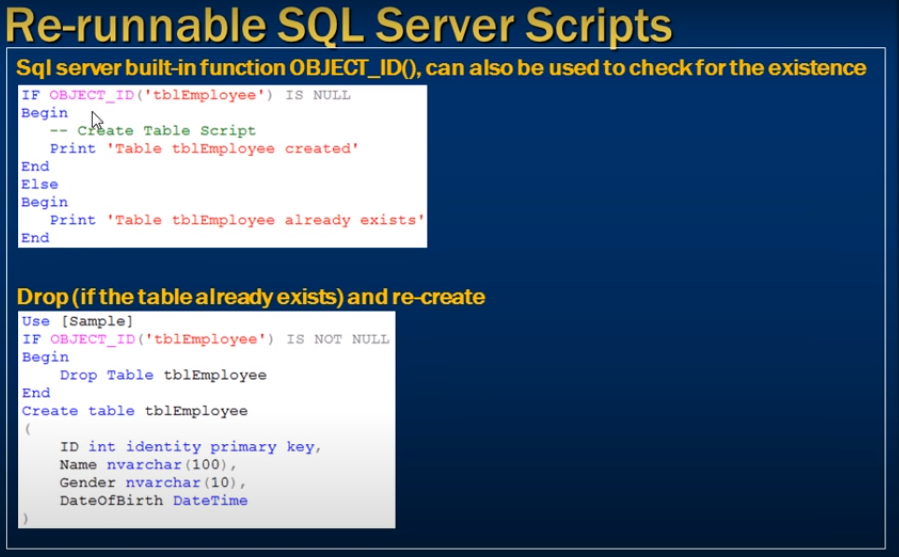
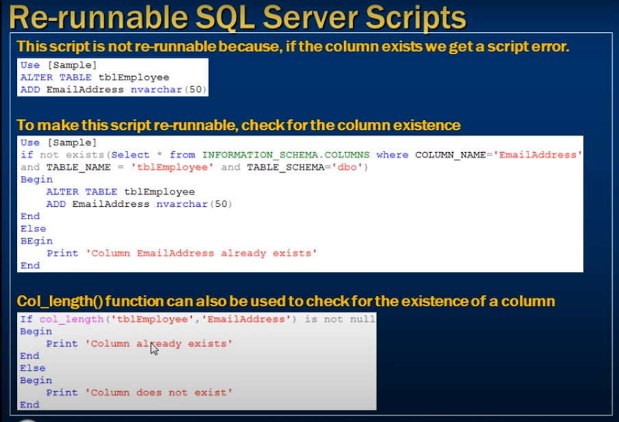

# Writing re runnable sql server scripts

- Writeing re-runnable sql server scripts



- A re runnable script is a script , that when run more than once, will not throw errors

--- 

### To make this script re-runnable 
1. Check for the existence of the table
2. Create the table if it does not exist
3. Elase print a message stating, the table already exists 

```sql
    -- This script is not re-runnable

    Use [Sample]
    Create table tblEmployee
    (
        ID int identity primary key,
        Name nvarchar(100),
        Gender nvarchar(10),
        DateOfBirth DateTime
    )
```

- How we can re-run this script

```sql
    Use [Sample]
    If not exists (Select * from information_schema.table where table_name = 'tblEmployee')
        Begin 
            Create table tblEmployee
            (
                ID int identity primary key,
                Name nvarchar(100),
                Gender nvarchar(10),
                DateOfBirth DateTime
            )
        End
    Else
        Begin
            print 'Table tblEmployee already exists'
        End
        
```



- Sql server build-in function OBJECT_ID(). can aslo be used to check for the existence

- Drop (if the table already exists) and re-create



- To make sure column is exists 
- col_length() function can also be used to check for existance of column 


