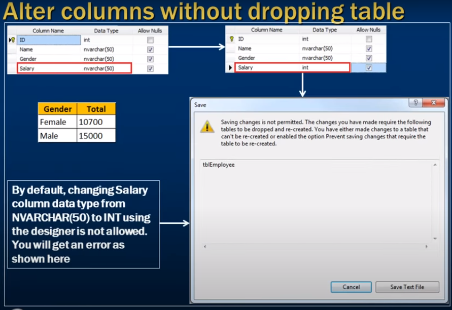
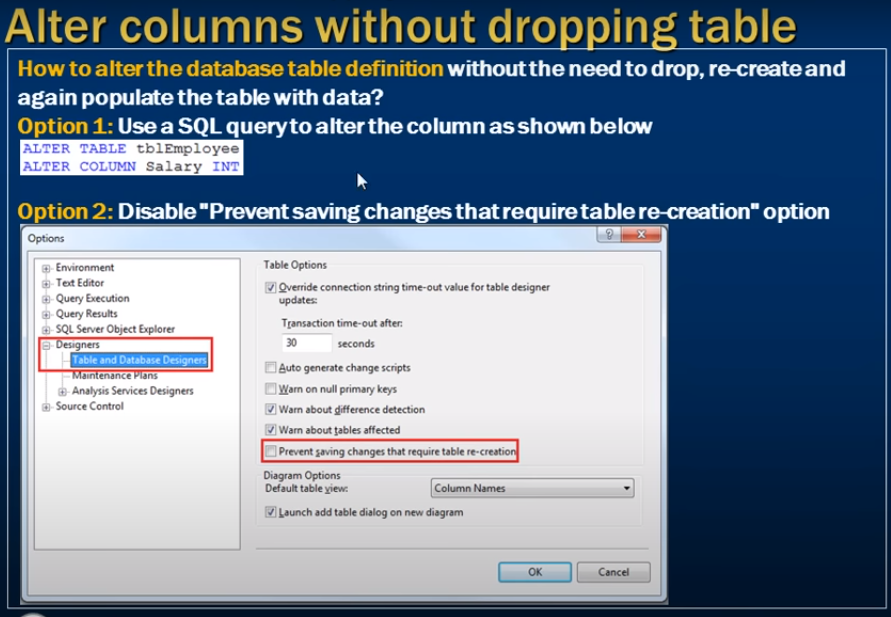

# Alter database table columns without dropping table 

- Alter database table columns without dropping table 



- altering column form desing show error 
- salary column decalre as nvarchar

```sql
    -- nvarchar can not use as aggregate function 

    Select Gender, Sum(Salary) as Total
    from tblEmployee
    Group by Gender

    -- It will show an error 

```



```sql
    Alter table tblEmployee
    Alter Column Salary int;
```


