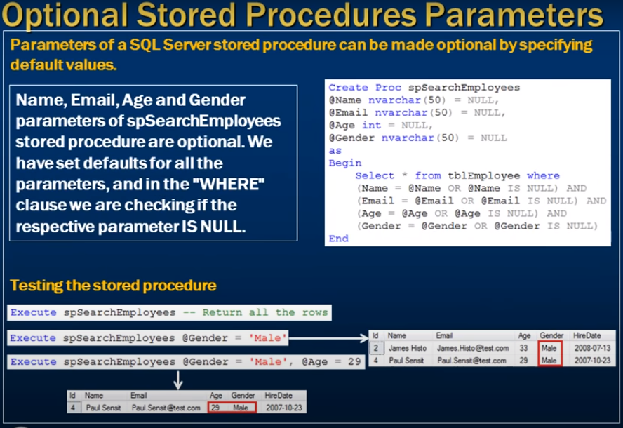

# Optional parameters in sql server stored procedures

- Optional parameters in sql server stored procedures 




```sql
    Create Proc spSearchEmployees
        @Name nvarchar(50),
        @Email nvarchar(50),
        @Gender nvarchar(50),
        @Age int
        As
        Begin
            Select * from tblEmployee
            where Name = @Name  and 
                Gender = @Gender and
                Email = @Email and
                Age = @Age 
        End

    -- Where execute this need parameter 

    Execute spSearchEmployee   -- expaceted parameter 

```

- To make this execute with optional paramter 
- We need to supply duplicate value 


```sql
    Create Proc spSearchEmployees
        @Name nvarchar(50) = NULL,
        @Email nvarchar(50) = NULL,
        @Gender nvarchar(50) = NULL,
        @Age int = null,
        As
        Begin
            Select * from tblEmployee
            where Name = @Name  and 
                Gender = @Gender and
                Email = @Email and
                Age = @Age 
        End

        -- now we execute sp without parameter 

        Execute spSearchEmployee

```


