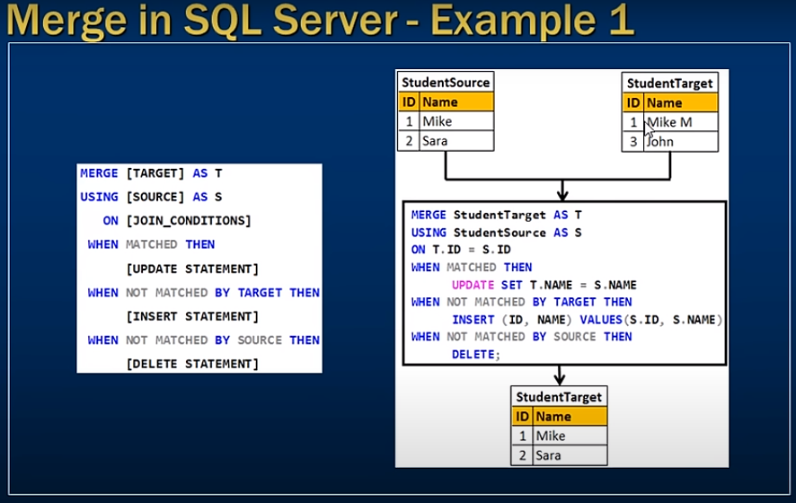
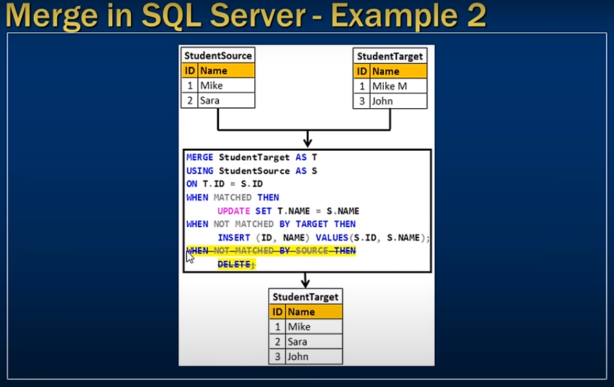

# Merge in SQL Server

- merge in SQL Server 




- We want to insert update and delete base on the source table

```sql
    -- Syntax of Merge query 
    Merge [Target] as T
    Using [Source] as S
        On [Join_Conditions]
    When Matched Then 
          [Update Statement ]
    When Not matched By Target Then
          [Insert Statement]
    When Not Matched by Source then 
          [Delete Statement]
```

```sql
    Merge StudentTarget as T
    Using StudentSource as S
        on T.Id = S.Id
    When Matched Then
        Update Set T.Name = S.Name
    When Not Matched by Target then
        Insert (Id, Name) values (S.Id, S.Name)
    When Not Matched by Source then
        Delete;
```

- do not need Delete statement 
- You can ommit this part 
