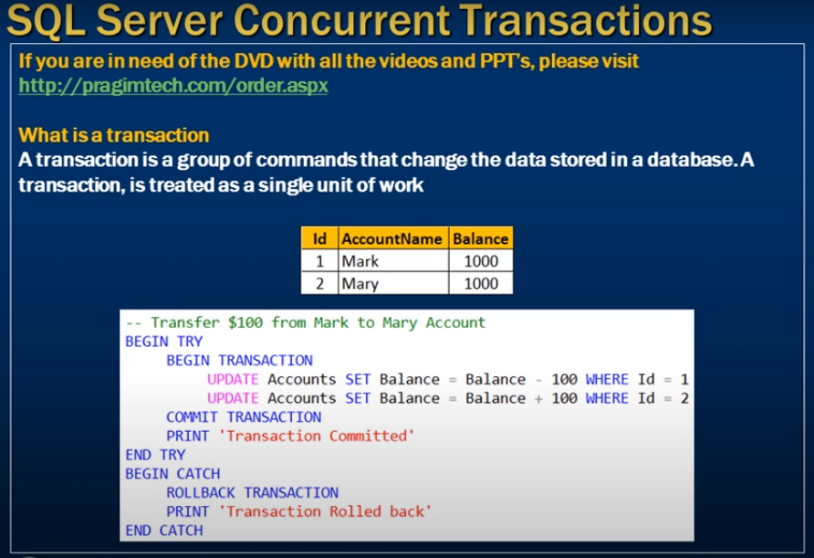
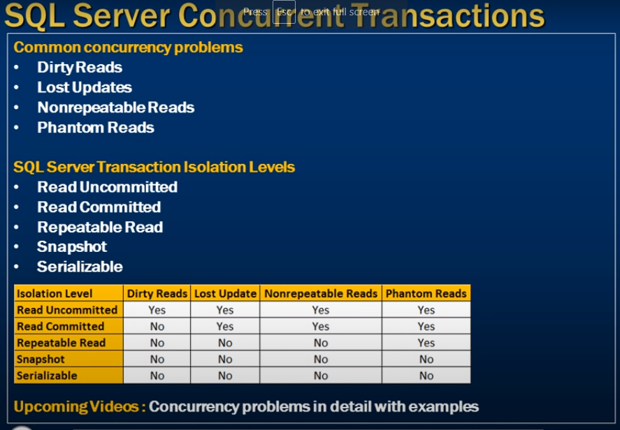

# concurrent transactions

- What is a transaction 
- The problems  that might arise when transaction are run concurrently 
- The different transaction isolation levels provided by sql server to address concurrency side effects 




## What is a transaction 
- A transaction isa group of commands that change the data sorted in a database. A transaction is treated as a single unit of work

```sql
    -- Transfer $100 from Mark to Mary Account

    Begin Try
        Begin Transaction 
            Update Account Set Balance = Balance - 100 where Id = 1
            Update Account Set Balance =  Balance  + 100 where Id = 2

            -- Commit transaction 
            Commit Transaction
            Print 'Transaction Commited'
    End Try
    Begin Catch
        Rollback Transaction
        print 'Transaction Rolled back'
    End Catch
```

- Many user use the database at same time 
- It may occure some issue 
- How to maintain integrity




- some time arrive some concurrent isue 
- mulitpule user use same data at same time 

## Common concurrency problems

- Dirty Reads
- Lost Updates 
- Nonrepeatable reads
- Phantom Reads

## SQL server transaction isolation levels 
- Read Uncommitted
- Read Commmitted
- Repeatable Read
- Snapshot
- Serializable 


