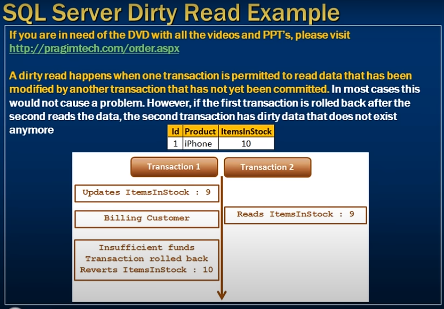
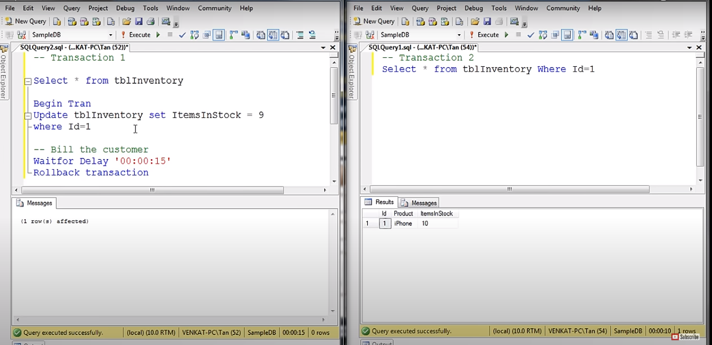
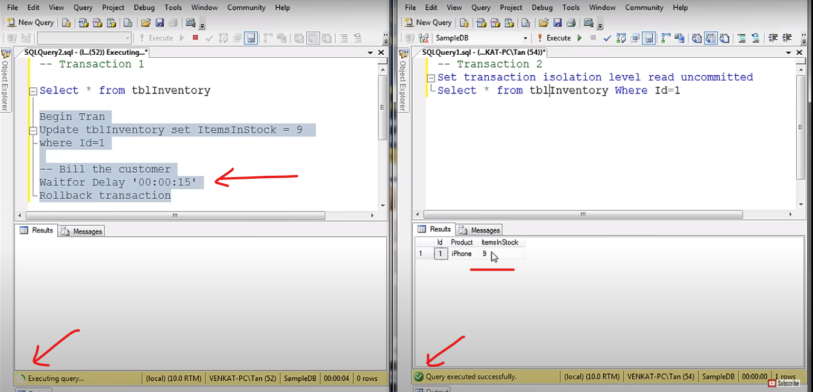

# dirty read Concurrency Problem 

- Dirty read concurrency problem with an example 

- When it happend 

- A dirty read happens when one transaction is permitted to read data 
- that has been modified by another transaction 
- that has not yet been committed.

- In most cases this would not cause a problem.
- However if the first transaction is rolled back 
- after the second reads the data
- the second transaction has dirty data that
- does not exist anymore 

     

- Default Isolaction is `Read commited`

# window 1

```sql 
    -- Transaction 1
    Select * from tblInventory

    Begin Tran
        Update tblInventory set ItemsStock = 9 where Id = 1
    
    -- Bill the customer
    Waitfor Delay '00:00:15'
    Rollback Transaction

    -- After 15 s block then rollback the transaction
```

# Window 2

```sql
    -- Transaction 2

    Select * from tblInventory where Id = 1

    -- After 15 s block get the data 10 
```

     

---
- Cheange the Isolation level 
- `To See Uncommited data`
# Window 2

```sql
    -- Transaction 2
    Set transaction isolation level read uncommitted
    Select * from tblInventory where Id = 1

    -- After before 15 s this qurry execute get the data 9 
```


     

- Read Uncommitted transaction isolation level is the only isolation level that has dirty read side effect.

- This is the least restrictive of all the isolation levels. when this transaction level is set
- it is possible to read uncommitted or dirty data 
- Another option to read dirty data is by using `Nolock` table hint.

```sql
    Select * from tblInventory (NoLock) where Id = 1
```