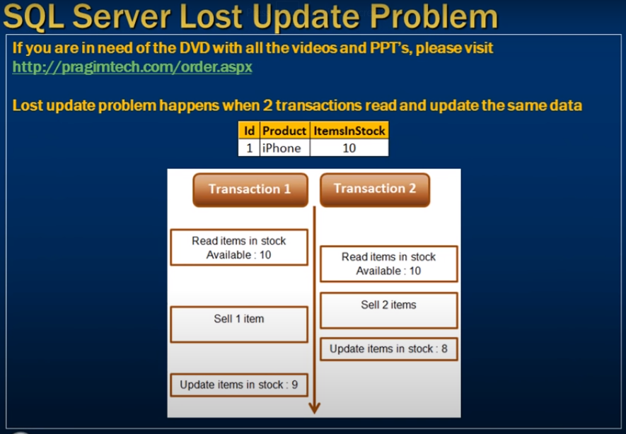
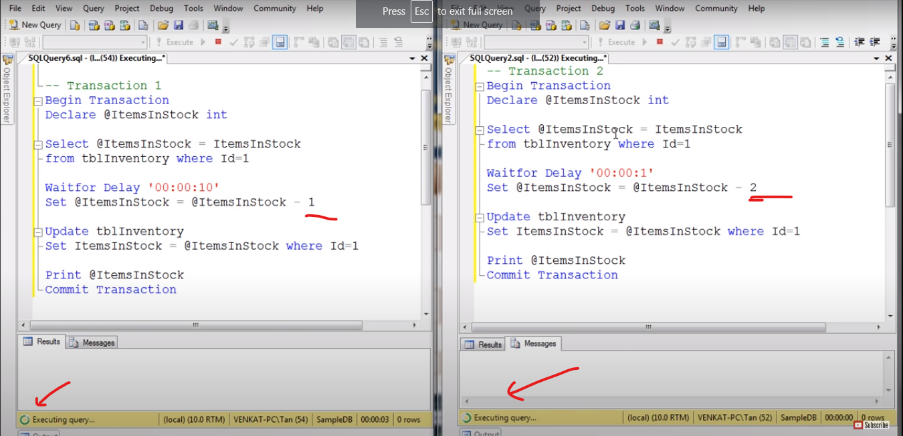
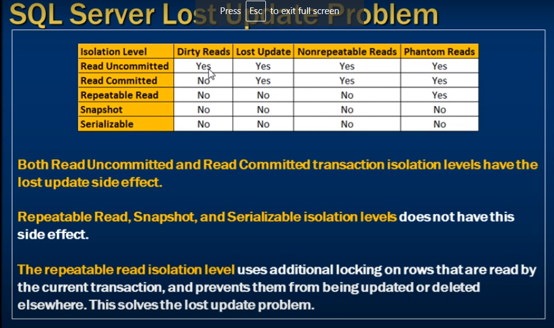

# lost update problem

- The lost update problem 

- Lost update problem happens when 2 transactions read and update the same data




- Transaction start at same time 




- output of the stock is not 9 
- but both transactions sell 3 item 

--- 
- Transaction 1 silently overwriten of transaction 2

- The default transaction Isolation is `Read committed`

- This lost update problem Present on  `Read committed and Read Uncommitted`
- The heigher isolation level this problem not present 

--- 
- Both the transaction give Isolation `Repeatable Read`

```sql
    -- Transaction 1

    Set Transaction Isolation level Repeatable Read

    Begin Transaction
        Declare @ItemsInStock int 

        Select @ItemsInStock = ItemsInStock 
        From tblInventory where Id = 1

        Waitfor Delay '00:00:10'
        Set @ItemsInStock = ItemsInStock - 1

        Update tblInventory
        Set ItemsInStock = @ItemsInStock
        where Id = 1

        print @ItemsInStock

        commit Transaction
```

```sql
    -- Transaction 2
    
    Set Transaction Isolation level Repeatable Read

    Begin Transaction
        Declare @ItemsInStock int 

        Select @ItemsInStock = ItemsInStock 
        From tblInventory where Id = 1

        Waitfor Delay '00:00:10'
        Set @ItemsInStock = ItemsInStock - 2

        Update tblInventory
        Set ItemsInStock = @ItemsInStock
        where Id = 1

        print @ItemsInStock

        commit Transaction

        -- When first tranaction start 
        -- then second got an error 
        -- no transaction can read or modify data

```
- the Effor message show 
- Transaction (Process Id 52) was deadlocked on lock resources whith another process and has been chosen as the deadlock victim. Return the trancsction 




- Both Read Uncommitted and Read Committed transaction isolation levels have the lost update side effect

- Repeatable Read, Snapshort and Serializeable isolation level does not have this side effect.

- The repeatable reade isolation level usese additional locking no rows 
- that are read by the current tranaction and prevents them from being updated or deadlock elsewhere 
- thise slove the lost update problem


