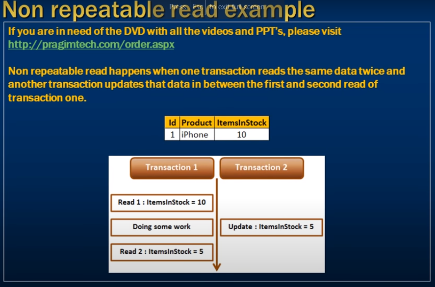
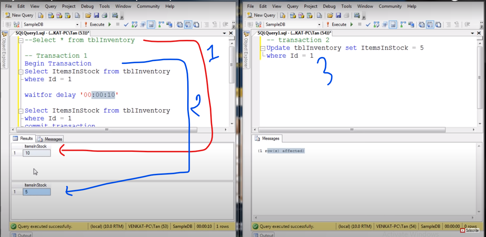
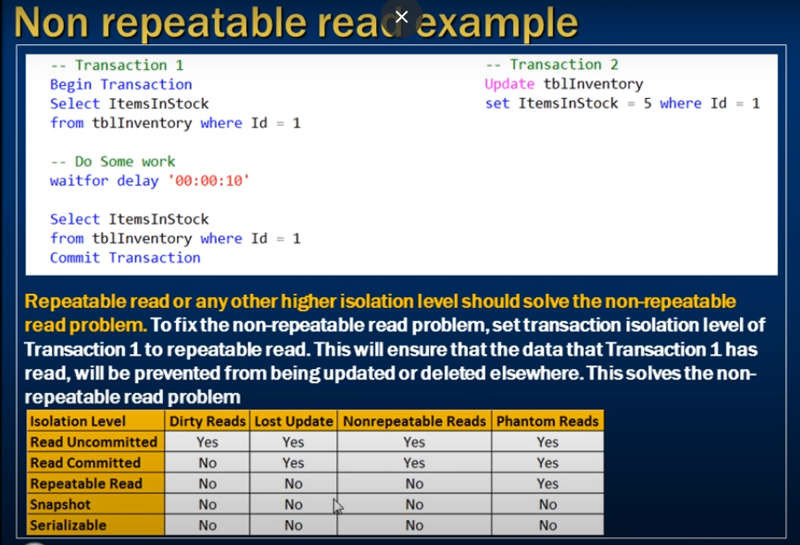
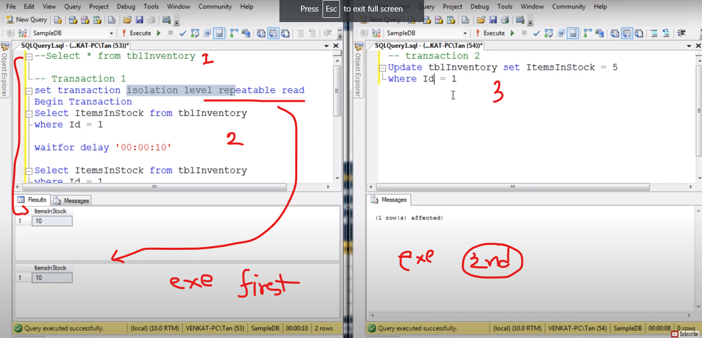

# Non repeatable read example in sql 

- Non repeatable read concurrency problem

- Non repeatable read happenens when one transaction reads the same data twice 
- and another tranaction updates that data in between the first and second read of transaction one.

- Transaction 1 start
- delay is 10 s
- but transaction 2 execute
- Transaction 1 read the data (5)
- The issue is non-repeatable transaction 

- Non Repeatable Transaction this the problem `Read Commited and Readn Uncommited`

- to solve this we need to Heigher the Isolation  Level `Repeatable Read , Snapshot, Serializable`

--- 

- Both transaction run as same time 

- When transction 1 is done
- After that Transaction 2 execute 

