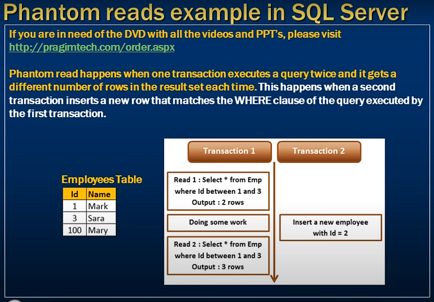
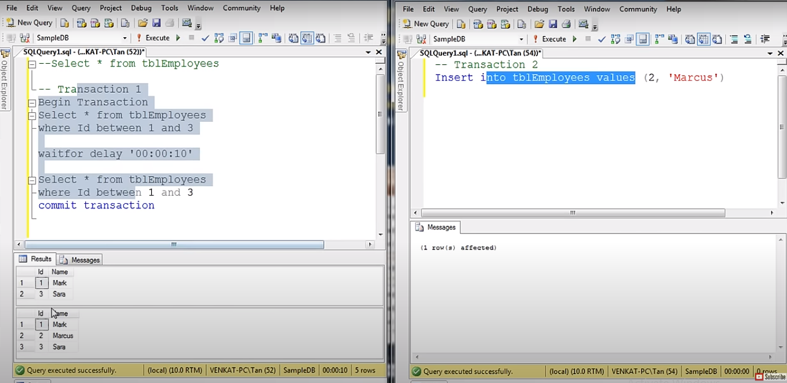
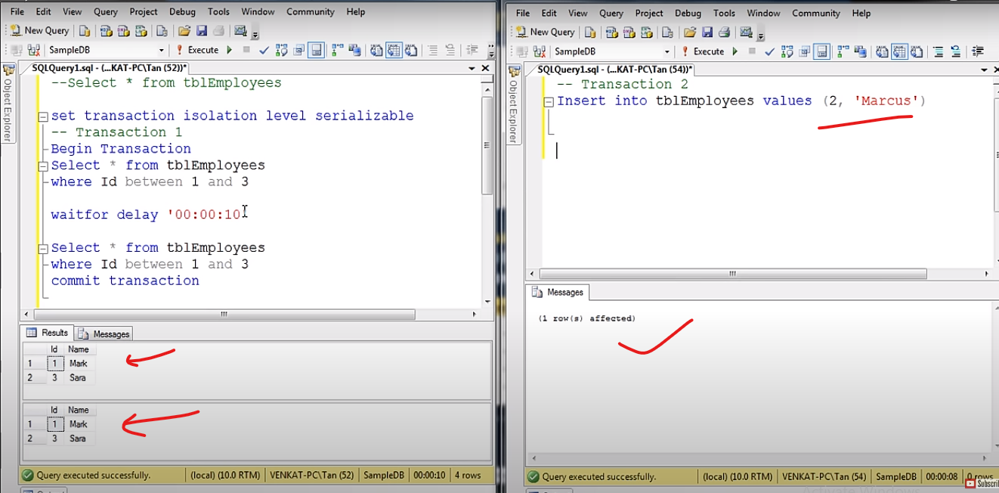
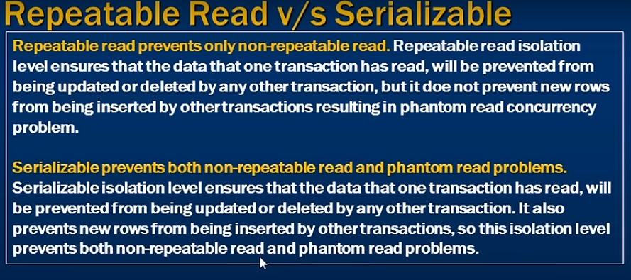

# Phantom reads example in sql 

- Phantom reads example in sql server
- Phantom read happens when one transaction executes a query twice
- and it gets a different number of rows in the result set each time
- This happens when a second transaction inserts a new row that matches the where clause of the query executed by the first transaction
---
1. first transaction 1 start 
2. in the middle transaction 2 issued
3. again transaction 1 start this query get extra result coz 2nd insert some values
--- 

- tran 1 get 2 row
- when tran 1 start in between tran 2 execute (Not block 2nd tran)
- extra row insert 2nd tran
- tran 1 get more rows (3 row)

--- 

- To mitigate pantom reads problem 
- we have to  give Isolation level `Snapshot or Serializable`

---

- After Tran 1 execute then allow tran 2 execute 
- coz we apply serialized transaction

---
- This Range lock apply by sql server
- 1 to 3 row lock 
- We are not allowed to insert any row in between this range 

---
 What is the difference between this 

Repeatable read 
    - only Isolation the update and deleted other transaction
    - insert not prevent 

Serializable prevent 
    - Both serializable is supported update delete or insert any other transaction 
    - Both non-repeatable read and phantom read problems 

