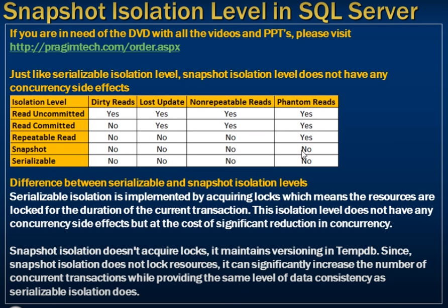

# Snapshot isolation level in sql server

- Snapshot Isolation level in SQL server





- Serialize transaction run but not commited
- 2nd transaction block coz isolation 
- Tran 1 lock the resorces 
- when tran 1 commited that time 2nd execute 


--- 

- To allow spanshot Isolation
- We have to tell database
- by altering 

```sql 
    Alter Database SampleDB
    Set Allow_Sanpshot_Isolation ON
```

-  Tran 1 start but not commited
- Tran 2 start then `Read` is allow  Not block 
- get value from Temp table of versioning 
- Tran 2 commited  data save permanently 
- table 


- When update It not allow in case Isolation level snapshot (Serialize block the resorce in case update or delete)

- Trans 1 comited 
- Trans 2 is faild with error message
- `Snapshot isolation transaction aborted due to update confilit`


