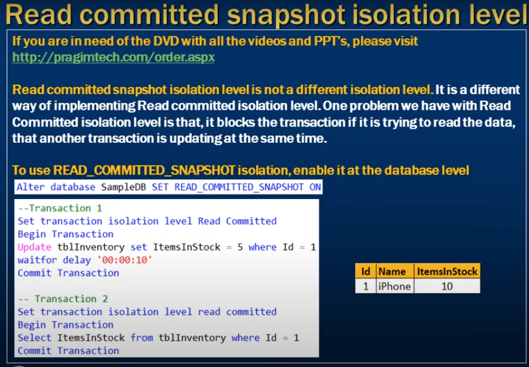
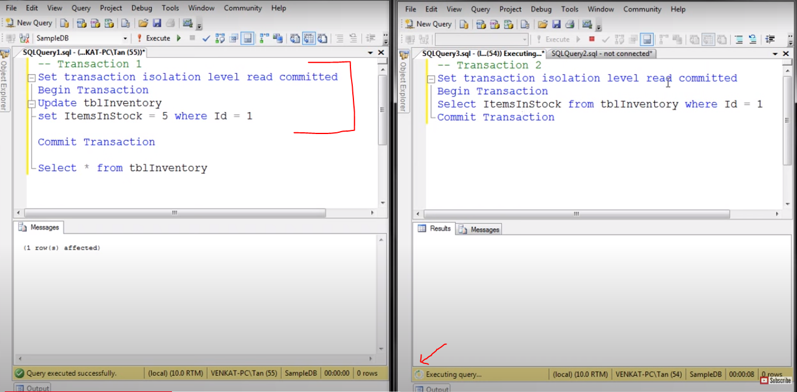
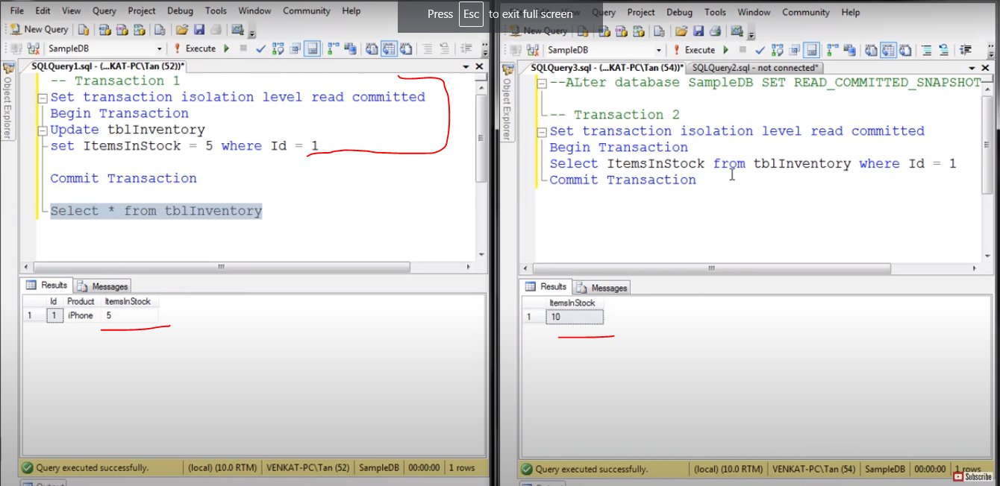

# Read committed snapshot isolation level in sql 

- Read committed snapshot isolation level in SQL server

--- 
- Read commited snapshot isolation level is not a different isolation level.
- It is a different way of implementing Read committed isolation level.
- One problem we have with read committed isolation level is that 
- it blocks the transaction if 
- it is trying to read the data 
- that another tranasaction is updating at the same time



- Read commited has default behavior when update data by 1st Transaction
- block the another transaction 
- 



---
- What happend when we using Read commited snapshot isoalation level 
- `We have to enable database in database level`

```sql
    Alter database SampleDb
    Set Read_Commited_Snapshot ON
```

- Trans 2 is not block 
- here value is 10 
- Trans 1 is start but not commited 
- Read value is not block 




- Similer behavior of `Allow_Snapshot_Isolation`

- What is the difference between `Read_Commited_Snapshot` and `Allow_Snapshot_Isolation`

