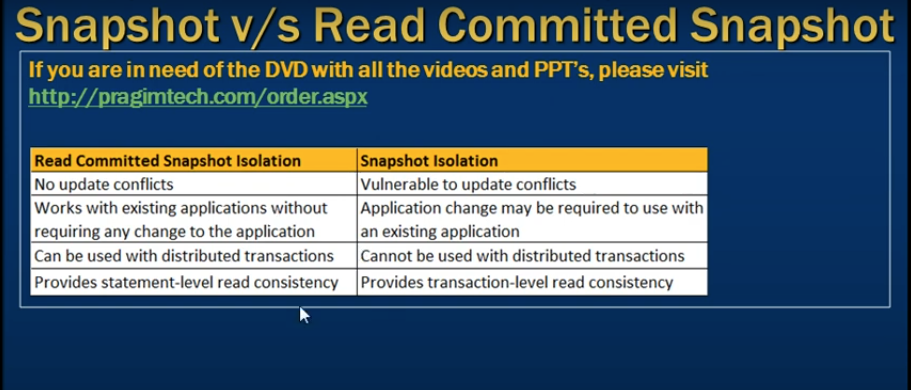
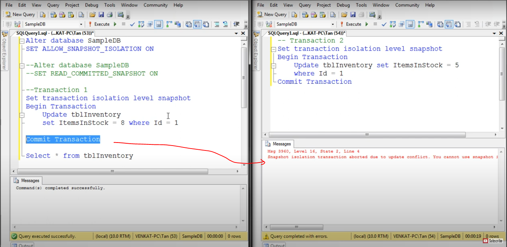
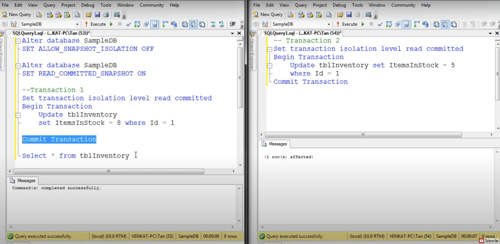

# Difference between snapshot isolation and read committed snapshot

- Difference between snapshot isolation and read committed snapshot 

- Snapshot Isolation when we use
- Update Update conflict 
- Same data at the same time 
- Reise an error 

- Now see when we use `Read Commited Isolation`
- trans 1 start 
- Trasn 2 start and block
- when trasn 1 commited imidiately 
- Trasn 2 successfull

Note: 
- Read Commited snapshort Isolation Can be used with distributed transactions
- Where as Snapshot isolation can not be used with distributed transactions 