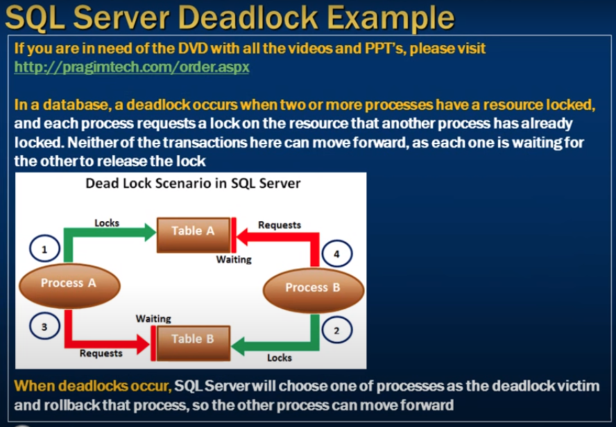
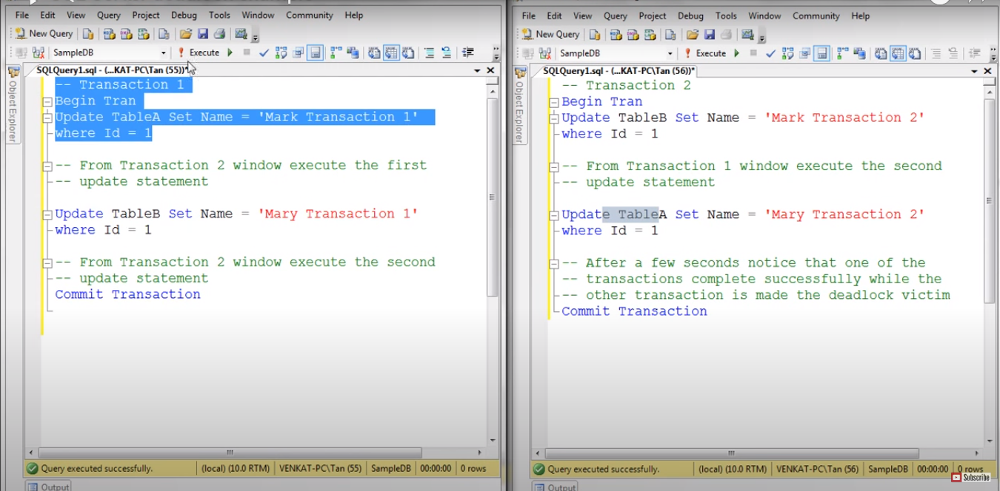
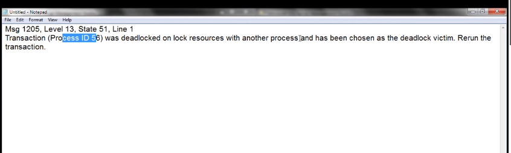
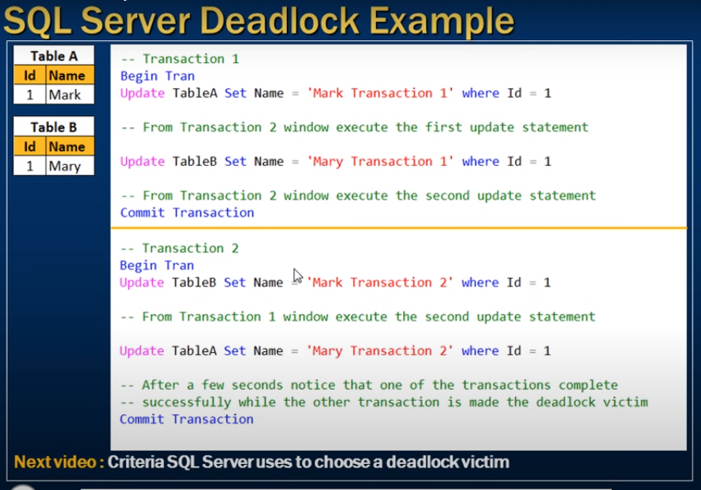

# deadlock example

- Deadlocks in sql server 

---

- In a database a deadlock occurs when two or more processes have a resource locked
- each process requests a lock on the resource that another process has already locked
- Neither of the tranascations here can move forward
- as each one is waiting for the other to relase the lock 

- When deadlocks occur 
- SQl server will choose one of processes as the deadlock victim
- and rollback that process
- so the other process can move forwared 

---

- Trans 1 start TableA update
- Trasn 2 start TableB update
- Both exclusively lock both the resouce 

- Again Trasn 1 TableB want to update but it already block by other 

- Again Trasn 2 TableA want to execute but blocked 
- After few minute 
- Trasnction identify the victim 
- trought an error 

