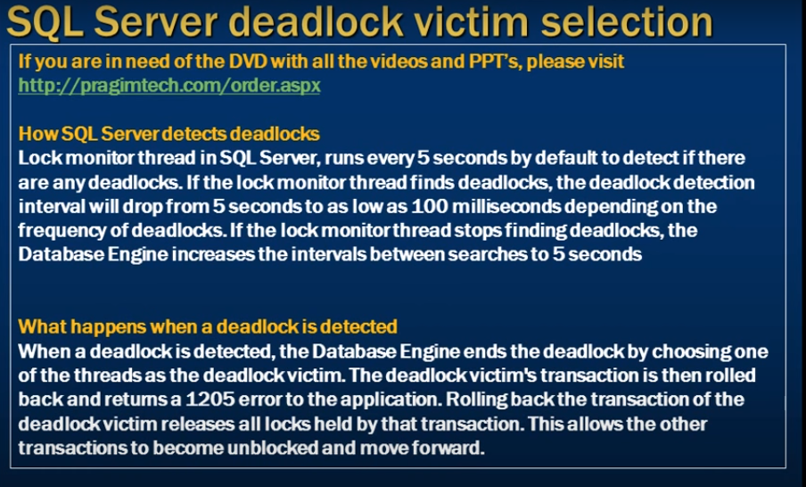
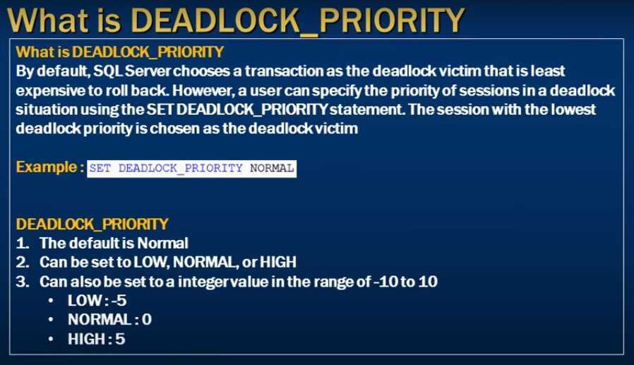
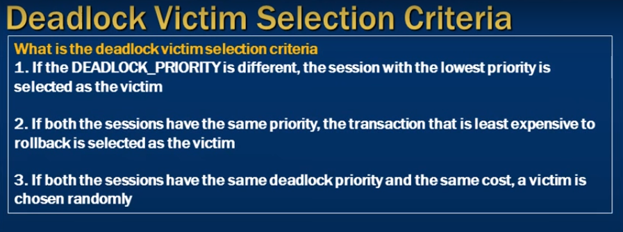
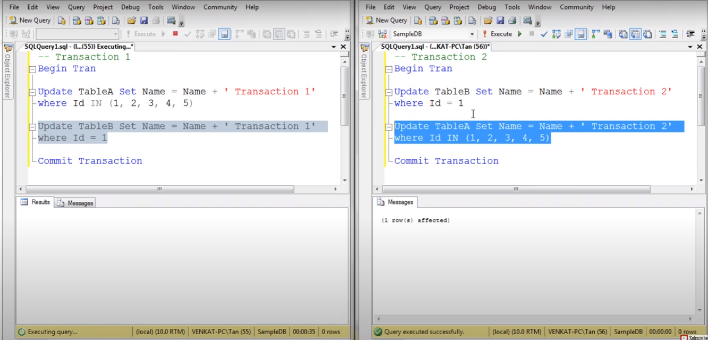
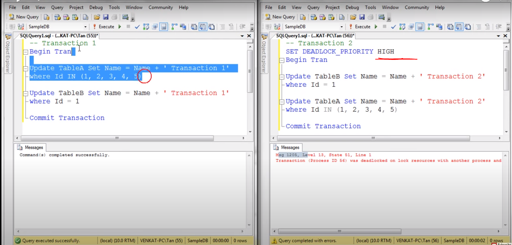

# deadlock victim selection

 How Sql server detects deadlocks
 - what happens when a deadlock is detected
 - what is Deadlock_proprity
 - what is the criteria that sql server uses to choose a deadlock victim when ther is a deadlock 

 --- 

- Transaction 2 easly rolback coz it is only updating the only one row 

- Set Trasction 2 as heigher priority 
- Transaction 1 as default 
- when deadlock occure in between 
- the transaction 1 as coniser as victim 

