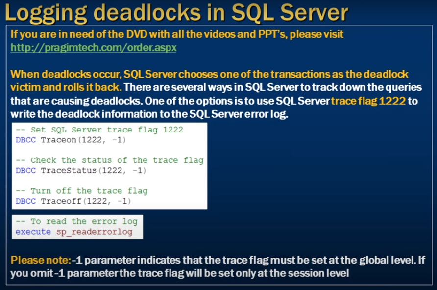

# Logging deadlocks in sql server

- How to write the deadlock information to the SQL server error log


- When deadlock occur, SQL Server chooses one of the transactions as the deadlock wictim and rolls it back
- There are serveral ways in SQL Server to track down the queries
- that are causing deadlocks 
- One of the options is to use SQL Server trace flag `1222` to 
- Write the deadlock informationt o the SQL Server error log

- (1222) session level 
- (1222, -1) to enable at global level 



Please Note: -1 parameter indicates that the trace flag 
- must be set the global level. If you omit-1 
- Parameter the trace flag will be set only at the session level


```sql
    -- To see error log
    Execute sp_readerrorlog
```