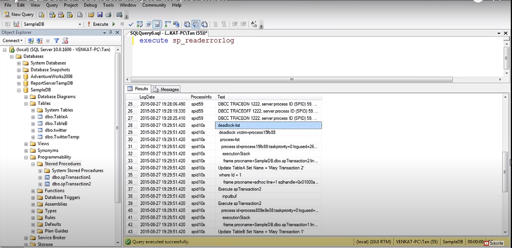

# deadlock analysis and prevention

- How to read and analyze sql server deadlock informaton captured in error log

- Resources list - objectname

- Owner id process is lock on it 
-  that process Id successfuly execute it 

- Deadlock prevent by access by same order 

