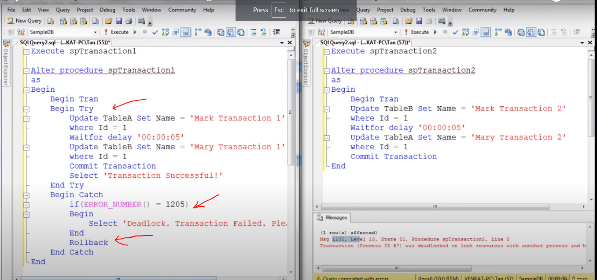

# deadlock error handling

- How to catch deadlock error using try / catch in SQL server

---
- Using Try-Catch block 
- We can handel the error of 
- If block check the deadlock error 

in _ 84 video API based Try catch use 

